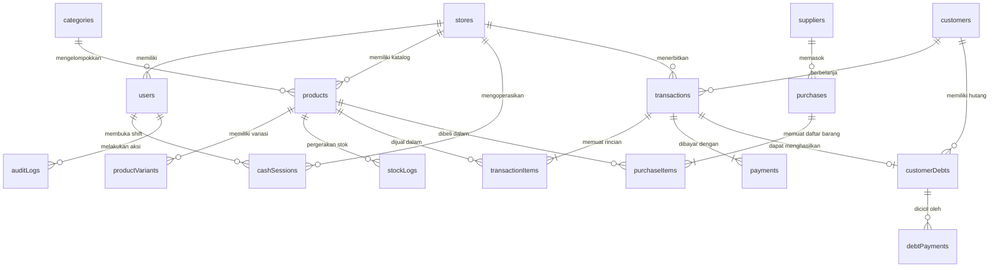
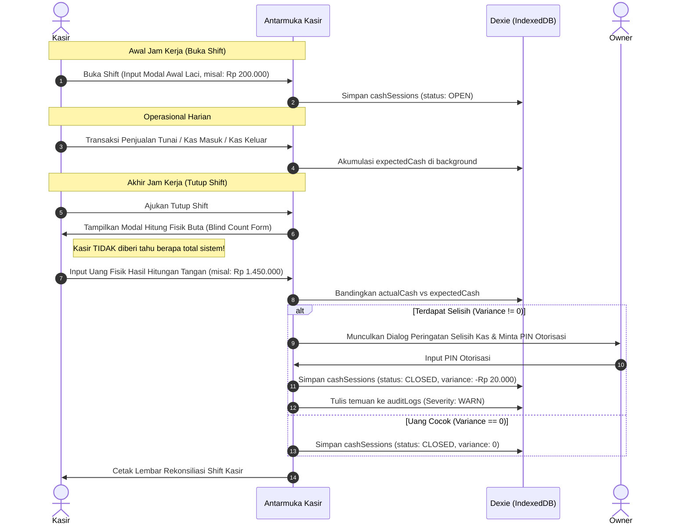

# 📖 KASIRIO ARCHITECTURE BIBLE v1.0
### *Kitab Arsitektur & Master Blueprint Sistem Kasirio*
**Platform Point of Sale (POS) & Operasional Bisnis UMKM Indonesia Berbasis PWA Offline-First**

---

> **STATUS DOKUMEN:** RESMI & AKTIF (Single Source of Truth)  
> **VERSI DOKUMEN:** 1.0.0 (Genesis Edition)  
> **AUTHOR:** Chief Software Architect & Core Engineering Team Kasirio  
> **TANGGAL RILIS:** September 2026  
> **KLASIFIKASI:** Internal Technical Blueprint & Engineering Standard  
> **ACUAN BENCHMARK:** Square POS Architecture, Shopify POS Offline Engine, Toast Architecture, Odoo Modular POS

---

## DAFTAR ISI UTAMA

- [BAGIAN I — FOUNDATION](#bagian-i--foundation)
  - [Bab 1 — Visi, Misi & Filosofi Produk](#bab-1--visi-misi--filosofi-produk)
  - [Bab 2 — Sepuluh Prinsip Arsitektur Kasirio](#bab-2--sepuluh-prinsip-arsitektur-kasirio)
  - [Bab 3 — Cakupan Produk & Batasan Sistem (Product Scope)](#bab-3--cakupan-produk--batasan-sistem-product-scope)
  - [Bab 4 — Terminologi Resmi & Ubiquitous Language](#bab-4--terminologi-resmi--ubiquitous-language)
  - [Bab 5 — Ikhtisar Arsitektur Sistem (High-Level Architecture)](#bab-5--ikhtisar-arsitektur-sistem-high-level-architecture)
- [BAGIAN II — PRODUCT ARCHITECTURE](#bagian-ii--product-architecture)
  - [Bab 6 — Technology Stack Bible](#bab-6--technology-stack-bible)
  - [Bab 7 — Struktur Direktori & Organisasi Kode](#bab-7--struktur-direktori--organisasi-kode)
  - [Bab 8 — Arsitektur Modul & Batasan Konteks (Bounded Context)](#bab-8--arsitektur-modul--batasan-konteks-bounded-context)
  - [Bab 9 — Arsitektur Routing & Navigasi](#bab-9--arsitektur-routing--navigasi)
  - [Bab 10 — Arsitektur State Management](#bab-10--arsitektur-state-management)
- [BAGIAN III — DATABASE ARCHITECTURE](#bagian-iii--database-architecture)
  - [Bab 11 — Filosofi Basis Data Offline-First](#bab-11--filosofi-basis-data-offline-first)
  - [Bab 12 — Dexie Schema Bible (Spesifikasi 21 Tabel)](#bab-12--dexie-schema-bible-spesifikasi-21-tabel)
  - [Bab 13 — Entity Relationship Bible (ERD)](#bab-13--entity-relationship-bible-erd)
  - [Bab 14 — Kebijakan Migrasi Skema Basis Data](#bab-14--kebijakan-migrasi-skema-basis-data)
  - [Bab 15 — Siklus Hidup & Retensi Data](#bab-15--siklus-hidup--retensi-data)
- [BAGIAN IV — POS ENGINE](#bagian-iv--pos-engine)
  - [Bab 16 — Transaction Lifecycle Engine](#bab-16--transaction-lifecycle-engine)
  - [Bab 17 — Cart Engine & Antrean Transaksi](#bab-17--cart-engine--antrean-transaksi)
  - [Bab 18 — Payment Engine](#bab-18--payment-engine)
  - [Bab 19 — Receipt Engine (Dual-Mode Thermal & Dynamic QR)](#bab-19--receipt-engine-dual-mode-thermal--dynamic-qr)
  - [Bab 20 — Barcode Engine & Low-Latency Hardware Buffer](#bab-20--barcode-engine--low-latency-hardware-buffer)
- [BAGIAN V — INVENTORY ENGINE](#bagian-v--inventory-engine)
  - [Bab 21 — Arsitektur Produk & Master Data](#bab-21--arsitektur-produk--master-data)
  - [Bab 22 — Immutable Inventory Movement Ledger](#bab-22--immutable-inventory-movement-ledger)
  - [Bab 23 — Purchase Engine & Supplier Management](#bab-23--purchase-engine--supplier-management)
  - [Bab 24 — Stock Opname & Reconciliation Engine](#bab-24--stock-opname--reconciliation-engine)
  - [Bab 25 — Multi-Unit & UoM Conversion Engine](#bab-25--multi-unit--uom-conversion-engine)
- [BAGIAN VI — CUSTOMER & FINANCE](#bagian-vi--customer--finance)
  - [Bab 26 — Customer Engine & Rekam Belanja](#bab-26--customer-engine--rekam-belanja)
  - [Bab 27 — Kasbon Engine (Piutang Usaha Tradisional)](#bab-27--kasbon-engine-piutang-usaha-tradisional)
  - [Bab 28 — Cash Session Engine (Shift Kasir & Rekonsiliasi Kas)](#bab-28--cash-session-engine-shift-kasir--rekonsiliasi-kas)
  - [Bab 29 — Reports & Financial Analytics Engine](#bab-29--reports--financial-analytics-engine)
- [BAGIAN VII — SECURITY ARCHITECTURE](#bagian-vii--security-architecture)
  - [Bab 30 — Arsitektur Autentikasi & PIN Gate](#bab-30--arsitektur-autentikasi--pin-gate)
  - [Bab 31 — Arsitektur Otorisasi (Role & Permission Matrix)](#bab-31--arsitektur-otorisasi-role--permission-matrix)
  - [Bab 32 — Audit Logging & Forensic Trail](#bab-32--audit-logging--forensic-trail)
  - [Bab 33 — Backup & Disaster Recovery Engine](#bab-33--backup--disaster-recovery-engine)
- [BAGIAN VIII — PLATFORM SERVICES](#bagian-viii--platform-services)
  - [Bab 34 — PWA Engine & Service Worker Lifecycle](#bab-34--pwa-engine--service-worker-lifecycle)
  - [Bab 35 — Storage Persistence & Eviction Shield](#bab-35--storage-persistence--eviction-shield)
  - [Bab 36 — Printer Hardware Abstraction Layer](#bab-36--printer-hardware-abstraction-layer)
  - [Bab 37 — Settings & Business Parameter Engine](#bab-37--settings--business-parameter-engine)
- [BAGIAN IX — AI ARCHITECTURE](#bagian-ix--ai-architecture)
  - [Bab 38 — AI Co-Pilot & Multimodal Assistant](#bab-38--ai-co-pilot--multimodal-assistant)
- [BAGIAN X — FUTURE ARCHITECTURE](#bagian-x--future-architecture)
  - [Bab 39 — Cloud-Ready Architecture & Sync Engine](#bab-39--cloud-ready-architecture--sync-engine)
  - [Bab 40 — Roadmap Evolusi Arsitektur 5 Tahun](#bab-40--roadmap-evolusi-arsitektur-5-tahun)
- [STANDAR KINERJA (NON-FUNCTIONAL REQUIREMENTS)](#standar-kinerja-non-functional-requirements)
- [STANDAR KODING & POLA IMPLEMENTASI](#standar-koding--pola-implementasi)
- [ARCHITECTURE DECISION RECORDS (ADR-001 s/d ADR-020)](#architecture-decision-records-adr)
- [RFC INDEX (RFC-001 s/d RFC-025)](#rfc-index)
- [GLOSARIUM ISTILAH TEKNIS & BISNIS](#glosarium-istilah-teknis--bisnis)
- [APPENDIX A s/d J](#appendix)

---

# BAGIAN I — FOUNDATION

---

## Bab 1 — Visi, Misi & Filosofi Produk

### 1.1 Apa itu Kasirio?
**Kasirio** adalah platform Point of Sale (POS) dan manajemen operasional bisnis generasi baru yang dirancang secara spesifik untuk Usaha Mikro, Kecil, dan Menengah (UMKM) di Indonesia. Dibangun di atas fondasi arsitektur **Progressive Web App (PWA) Offline-First**, Kasirio mengoperasikan mesin transaksi kasir secara otonom di peramban (browser) pengguna tanpa membutuhkan ketergantungan konstan pada koneksi internet.

### 1.2 Visi Produk
> *"Mendigitalkan 10 juta UMKM Indonesia melalui platform operasional kasir pintar yang paling andal, transparan, cepat, dan sepenuhnya dimiliki oleh pelaku usaha tanpa hambatan biaya infrastruktur korporasi."*

### 1.3 Misi Produk
1. **Menghilangkan Friksi Checkout:** Memastikan transaksi kasir selesai dalam kurang dari 3 kali sentuhan/klik dengan latensi komputasi lokal di bawah 16 milidetik.
2. **Kedaulatan Data Mutlak (Data Sovereignty):** Menjamin bahwa setiap data transaksi, riwayat persediaan, dan buku piutang disimpan di perangkat lokal pelaku usaha, dapat dicadangkan, dan tidak pernah disandera oleh vendor SaaS (*no vendor lock-in*).
3. **Ketahanan Operasional 100%:** Mengeliminasi downtime akibat putusnya jaringan fiber optic, seluler, atau gangguan listrik melalui arsitektur penyimpanan lokal IndexedDB.
4. **Demokratisasi Kecerdasan Buatan:** Membawa kapabilitas AI Vision (OCR Nota Pasar Tradisional) ke tangan pedagang kecil untuk mengeliminasi input stok manual yang melelahkan.

### 1.4 Nilai Produk (Product Values)
- **Keandalan Ekstrem (Extreme Reliability):** Kasir tidak boleh mogok saat antrean panjang pembeli sedang menunggu.
- **Kesederhanaan Radikal (Radical Simplicity):** Antarmuka intuitif yang dapat dioperasikan oleh kasir berusia 18 hingga 65 tahun tanpa pelatihan teknis formal lebih dari 10 menit.
- **Akuntabilitas Finansial (Financial Integrity):** Mencegah kecurangan internal melalui audit log forensik dan gerbang PIN otorisasi ganda.

### 1.5 Positioning Pasar
Kasirio diposisikan sebagai **Platform Operasional Bisnis UMKM yang Berpusat pada Kasir (POS-Centric Business Management)**.
Kasirio **BUKAN** ERP Korporasi yang kaku dan rumit (seperti SAP, Oracle, atau Odoo Enterprise tanpa kustomisasi). Kasirio juga **BUKAN** sekadar aplikasi kalkulator digital tanpa manajemen persediaan. Kasirio berada pada *sweet spot* antara kemudahan kalkulator kasir dengan ketangguhan sistem akuntansi persediaan berbasis *double-entry inventory ledger*.

```
   Tingkat Kompleksitas
      ▲
      │                              [ SAP / Netsuite ]
      │                              (Terlalu mahal & rumit)
      │
      │                 [ Odoo / Mekari Jurnal ]
      │                 (Fokus Akuntansi Korporasi)
      │
      │       ★ KASIRIO ★
      │       (POS Cepat + Buku Kasbon + Ledger Stok + AI Nota)
      │       (100% Offline-First, Ramah Sentuh, Zero Config)
      │
      │   [ BukuKas / Catatan Manual ]
      │   (Hanya pembukuan pasif, tanpa POS hardware)
      └────────────────────────────────────────────────────────► Fokus Operasional Kasir Cepat
```

### 1.6 Target Market & Karakteristik Pengguna
Kasirio didesain untuk melayani segmen UMKM Indonesia dengan rincian karakteristik spesifik:

| Segmen Usaha | Skala Operasional | Tantangan Utama | Kebutuhan Utama Kasirio |
|---|---|---|---|
| **Warung Sembako & Kelontong** | 100–1.000 SKU, 50–300 transaksi/hari | Barcode scanner cepat, bon kasbon langganan tetangga | Barcode Buffer <50ms, Kasbon Engine terintegrasi |
| **Coffee Shop & Minuman Kekinian** | 20–100 SKU, variasi topping/sugar level | Kecepatan antrean jam sibuk, cetak struk thermal | Modifier Varian, Hold/Recall antrean meja, Struk 58mm |
| **F&B Resto Sederhana / Warteg Modern** | 50–150 menu, sistem antre bayar dulu | Split payment tunai & QRIS, soundbox konfirmasi | Dynamic QRIS, Soundbox Notifikasi Web Speech API |
| **Retail Pakaian / Butik** | 100–2.000 SKU, variasi ukuran/warna | Stock opname akurat, label barcode custom | Matrix Varian, Stock Opname Blind Count |
| **Usaha Jasa (Barbershop, Laundry)** | 10–50 layanan, per kasir/kapster | Komisi staf, antrean layanan | Service Mode, Audit log pembukaan laci kasir |

### 1.7 Unique Selling Proposition (USP)
1. **Zero-Latency Offline Mode:** Transaksi 100% berjalan normal saat kabel internet dicabut atau sinyal HP hilang.
2. **Dynamic QR Code Struk (Paperless):** Hemat biaya kertas thermal dengan menampilkan QR Code berbobot ringan yang dapat dipindai pembeli langsung dari layar kasir.
3. **OCR Nota Pasar AI:** Foto nota belanja pasar tradisional bertuliskan tangan langsung dikonversi menjadi draf pembelian stok bahan baku via Gemini Vision.
4. **Monetisasi Koin Kasirio (Closed-Loop Token):** Model langganan tanpa ketergantungan kartu kredit atau potongan 30% App Store — saat ini berjalan dalam mode simulasi sandbox sambil menunggu audit kepatuhan regulasi BI selesai (lihat ADR-006).

### 1.8 Problem-Solution Matrix

```
┌──────────────────────────────────────┬──────────────────────────────────────────┐
│ TANTANGAN UMKM INDONESIA             │ SOLUSI ARSITEKTUR KASIRIO                │
├──────────────────────────────────────┼──────────────────────────────────────────┤
│ Internet sering putus di ruko/pasar  │ IndexedDB (Dexie.js) + PWA Service Worker│
│ Biaya kertas struk thermal mahal     │ Dual-Mode Struk: QR Offline Scanner HP   │
│ Kasir mencurangi uang kembalian/void │ PIN Gate Otorisasi Owner + Audit Log     │
│ Input stok nota pasar makan waktu    │ Gemini Flash AI Multimodal Vision OCR    │
│ Browser sering menghapus data cache  │ navigator.storage.persist() Lock         │
│ Salah deteksi scanner barcode USB    │ Hardware Barcode Buffer Keydown Listener │
└──────────────────────────────────────┴──────────────────────────────────────────┘
```

---

## Bab 2 — Sepuluh Prinsip Arsitektur Kasirio

Prinsip-prinsip ini mengikat seluruh keputusan desain perangkat lunak, struktur data, antarmuka, dan integrasi di Kasirio. Setiap baris kode yang ditulis harus dapat diuji keselarasan terhadap 10 prinsip ini.

### 2.1 Prinsip 1: Offline First
- **Definisi:** Ketiadaan koneksi internet adalah keadaan operasional normal, bukan pengecualian (exception).
- **Implikasi Teknis:**
  - Basis data lokal (`Dexie.js` di atas `IndexedDB`) adalah sumber kebenaran primer (*source of truth*) saat aplikasi berjalan di kasir.
  - Tidak boleh ada permintaan jaringan (network request) yang memblokir rendering antarmuka kasir atau penuntasan transaksi checkout.
  - Seluruh pustaka JS, CSS, aset gambar inti, dan font disimpan di dalam cache Service Worker (*pre-cached assets*).

### 2.2 Prinsip 2: Fast by Default
- **Definisi:** Kecepatan adalah fitur inti. Setiap interaksi checkout harus memiliki latensi instan.
- **Implikasi Teknis:**
  - Latensi respons input tombol kasir < 16ms (60 FPS).
  - Latensi komitmen penulisan transaksi ke IndexedDB < 50ms.
  - Komponen keranjang belanja (*cart engine*) mengisolasi re-render hanya pada baris item yang berubah menggunakan React State memoization.

### 2.3 Prinsip 3: Data Ownership
- **Definisi:** Pengguna adalah pemilik tunggal atas data bisnis mereka.
- **Implikasi Teknis:**
  - Kasirio menyediakan utilitas pencadangan data lokal instan ke dalam format JSON terenkripsi/terkompresi tanpa memerlukan akun cloud.
  - Format penyimpanan basis data transparan dan dapat diekspor menjadi CSV/Excel kapan saja.

### 2.4 Prinsip 4: Cloud Ready
- **Definisi:** Arsitektur lokal dibangun sedemikian rupa sehingga siap disinkronkan ke cloud tanpa perlu merombak ulang skema data.
- **Implikasi Teknis:**
  - Semua entitas primer wajib menggunakan pengenal unik global berbasis teks: UUID v4 atau format terurut waktu kustom (`TRX-YYYYMMDD-XXXX`), bukan integer incrementing lokal yang rentan tabrakan data (collision) saat multi-perangkat digabungkan.
  - Semua entitas menyimpan metadata audit: `createdAt`, `updatedAt`, dan `deletedAt` (soft-delete).

### 2.5 Prinsip 5: Security by Design
- **Definisi:** Perlindungan terhadap kecurangan internal kasir dan integritas data dipasang di level terendah aplikasi.
- **Implikasi Teknis:**
  - PIN Owner disimpan dalam bentuk ter-hash menggunakan salt kriptografis lokal.
  - Aksi sensitif (Void penjualan, diskon manual besar, pembukaan laci kas manual) wajib melalui gerbang validasi otorisasi PIN.
  - Log audit forensik bersifat *immutable* (hanya bisa ditambah, tidak bisa diubah atau dihapus via UI).

### 2.6 Prinsip 6: Human-Centered UX (Desain Ramah UMKM)
- **Definisi:** Antarmuka dirancang untuk meminimalkan beban kognitif staf kasir di lapangan.
- **Implikasi Teknis:**
  - Elemen interaktif memiliki target sentuh minimal 48x48 piksel.
  - Kontras warna tinggi memenuhi kriteria WCAG AAA untuk visibilitas di layar HP murah atau di bawah pencahayaan terik pasar.
  - Semua teks terminologi menggunakan Bahasa Indonesia yang lugas dan natural bagi pedagang (contoh: *"Buku Kasbon"*, *"Cetak Struk"*, *"Laci Kas"*).

### 2.7 Prinsip 7: Modular Architecture
- **Definisi:** Modul-modul sistem terisolasi secara logis dengan antarmuka yang didefinisikan secara ketat.
- **Implikasi Teknis:**
  - Modul POS, Inventori, Keuangan, dan Pengaturan tidak boleh saling mengimpor status internal secara liar; komunikasi dilakukan melalui basis data atau service layer yang terstandarisasi.
  - Fitur F&B (Meja, Kitchen Ticket) dapat diaktifkan/dinonaktifkan tanpa menyisakan beban komputasi di mode Retail.

### 2.8 Prinsip 8: AI as Assistant, Never Replacement
- **Definisi:** Kecerdasan Buatan bertindak sebagai asisten pengurang kerja manual, bukan pengambil keputusan mutlak.
- **Implikasi Teknis:**
  - Fitur AI Vision (OCR Nota Pasar) wajib menerapkan pola **Human-in-the-Loop**: hasil ekstraksi ditampilkan dalam bentuk tabel pratinjau yang wajib divalidasi dan disetujui manusia sebelum stok masuk ke ledger.
  - Panggilan model AI tidak boleh menghentikan operasional kasir jika terjadi timeout atau kegagalan kuota API.

### 2.9 Prinsip 9: Indonesian Business First
- **Definisi:** Menghormati dan memfasilitasi budaya bisnis lokal Indonesia secara organik.
- **Implikasi Teknis:**
  - Dukungan bawaan untuk Kasbon (hutang langganan warung), Soundbox notifikasi pembayaran digital berbasis suara lokal, pembulatan harga ribuan rupiah, serta penyesuaian pajak PB1 Restoran (10%) dan PPN Retail (11-12%).

### 2.10 Prinsip 10: Evolution Without Rebuild
- **Definisi:** Kode harus dibangun untuk terus berkembang tanpa memerlukan refactoring total saat skala pengguna bertambah.
- **Implikasi Teknis:**
  - Menggunakan migrasi versi terprogram pada Dexie.js (`db.version(x).stores({...}).upgrade(...)`).
  - Abstraksi hardware (printer, scanner) dibungkus dalam adapter pattern sehingga pergantian driver tidak merusak logika bisnis inti.

---

## Bab 3 — Cakupan Produk & Batasan Sistem (Product Scope)

Kasirio membagi evolusi kapabilitas sistemnya ke dalam beberapa tingkatan rilis yang terukur untuk menghindari jebakan *scope creep*.

```
┌────────────────────────────────────────────────────────────────────────┐
│ V4 — Enterprise UMKM Network (Franchise, Supplier Marketplace, Auto AI) │
├────────────────────────────────────────────────────────────────────────┤
│ V3 — Multi-Branch Cloud Sync, Web Dashboard Owner, Realtime Central DB │
├────────────────────────────────────────────────────────────────────────┤
│ V2 — Multi-Unit Stok, Kasbon Otomatis WA, Purchasing PO, Split Payment │
├────────────────────────────────────────────────────────────────────────┤
│ V1 — Fondasi Stabil, Dexie Normalisasi, PIN Gate, QR Receipt, Barcode   │
├────────────────────────────────────────────────────────────────────────┤
│ MVP — Kasir Standalone, Keranjang, Transaksi Tunai/QRIS, Print Thermal │
└────────────────────────────────────────────────────────────────────────┘
```

### 3.1 Detail Matriks Cakupan Versi

| Domain Modul | MVP | V1 (Current Production) | V2 (Planned) | V3 (Future Cloud) | V4 (Enterprise) |
|---|---|---|---|---|---|
| **Storage Engine** | localStorage | IndexedDB Dexie Normalisasi | IndexedDB + Chunked Backup | Local DB + Cloud Sync Mesh | Multi-Tenant Cloud DB |
| **Transaksi POS** | Input manual, tunai | Barcode buffer, Tunai/QRIS/Kasbon | Split payment, Multi-hold cart | Multi-register real-time | Self-Checkout Kiosk |
| **Struk Belanja** | Thermal print saja | Thermal 58/80mm + Offline QR | Integrasi WhatsApp Gateway | Cloud Digital Invoice Link | E-Wallet Receipt Push |
| **Inventori** | Mutasi angka langsung | Immutable Stock Ledger | Multi-satuan (Box/Pcs), PO | Multi-Gudang, Transfer Cabang | Auto-Replenishment AI |
| **Keamanan** | Tanpa autentikasi | Salted PIN Gate + Audit Log | Role Manager & Cashier terpisah | Biometrik WebAuthn, JWT Cloud | Role RBAC Kustom Granular |
| **AI Co-Pilot** | Belum ada | OCR Nota Pasar (Human-in-loop) | Asisten Suara Input Pesanan | Prediksi Penjualan Harian | AI Otomatisasi Pajak & Suplai |

### 3.2 Yang BUKAN Bagian dari Kasirio (Anti-Scope / Boundaries)
Untuk menjaga ketajaman dan kecepatan produk, sistem Kasirio secara sadar **TIDAK** mencakup hal-hal berikut:
1. **Bukan Software Akuntansi Korporasi Double-Entry Penuh:** Kasirio tidak menyediakan buku besar jurnal debet-kredit umum yang rumit, depresiasi aset tetap berwujud, atau integrasi audit perpajakan korporat multi-nasional.
2. **Bukan Marketplace Publik / E-Commerce Builder:** Kasirio fokus pada manajemen operasional internal toko fisik dan katalog digital sederhana, bukan platform e-commerce multi-vendor seperti Shopee atau Tokopedia.
3. **Bukan Sistem Payroll & HRIS Kompleks:** Kasirio mencatat shift dan kasbon kasir, tetapi tidak menangani perhitungan PPh 21, BPJS Ketenagakerjaan, atau pengarsipan kontrak karyawan.

---

## Bab 4 — Terminologi Resmi & Ubiquitous Language

Seluruh arsitek, pengembang perangkat lunak, desainer produk, dan pembuat konten teknis wajib menggunakan terminologi yang seragam dalam domain Kasirio:

| Istilah Resmi Kasirio | Konsep Domain Teknis | Padanan Bahasa Inggris | Penjelasan Operasional |
|---|---|---|---|
| **Kasir (POS)** | Point of Sale Presentation Layer | Register / Checkout View | Layar interaksi utama untuk memasukkan item belanjaan dan menerima pembayaran. |
| **Keranjang (Cart)** | In-Memory Active Transaction State | Shopping Cart | Kumpulan produk, kuantitas, harga, dan diskon yang sedang dihitung sebelum transaksi dibayar. |
| **Gantung Transaksi (Hold Cart)** | Persisted Temporary Cart State | Suspended / Parked Order | Menyimpan sementara keranjang pelanggan yang antre/ditinggal dan melayani pelanggan berikutnya. |
| **Buku Kasbon** | Accounts Receivable Ledger | Customer Debt Ledger | Fasilitas pencatatan utang barang belanjaan pelanggan terpercaya yang dibayar di kemudian hari. |
| **Laci Kas (Cash Drawer)** | Physical & Logical Cash Storage | Cash Drawer / Till | Tempat uang fisik kasir; status buka laci dicatat dalam audit keamanan. |
| **Shift Kasir** | Cash Accountability Session Window | Cash Session / Work Shift | Rentang waktu tugas seorang kasir dari hitungan modal awal hingga serah terima kas akhir. |
| **Modal Awal** | Shift Starting Balance | Opening Float | Uang tunai pecahan kecil yang diletakkan di laci kas saat awal shift untuk kembalian. |
| **Selisih Kas (Variance)** | Discrepancy Reconciliation | Cash Variance | Perbedaan antara hitungan uang fisik kasir (*actual count*) dan ekspektasi sistem (*expected balance*). |
| **Ledger Stok (Stock Logs)** | Immutable Inventory Movement Stream | Inventory Ledger | Catatan abadi setiap penambahan atau pengurangan stok barang yang tidak pernah boleh dihapus. |
| **Struk QR Dinamis** | Offline Compressed Data Payload | Dynamic QR Receipt | Kode QR di layar kasir yang memuat ringkasan transaksi berformat JSON terkompresi. |
| **Soundbox Virtual** | Text-to-Speech Auditory Feedback | Audio Confirmation Service | Suara konfirmasi transaksi pembayaran berhasil menggunakan Web Speech API peramban. |
| **Koin Kasirio** | Closed-Loop Prepaid Service Token | Internal Service Credit | Token internal non-moneter untuk memperpanjang masa aktif fitur Pro toko. |
| **PIN Gate** | Step-Up Authentication Boundary | Authorization PIN Modal | Dialog penguncian aksi sensitif yang menuntut otorisasi PIN Owner. |
| **Batal Transaksi (Void)** | Post-Checkout Invalidation Event | Transaction Void | Pembatalan transaksi yang sudah lunas dengan mengembalikan stok barang ke ledger. |

---

## Bab 5 — Ikhtisar Arsitektur Sistem (High-Level Architecture)

Kasirio dirancang menggunakan arsitektur multi-layer terisolasi yang menempatkan peramban klien sebagai pusat pemrosesan lokal, didukung oleh Service Worker untuk keandalan offline dan Server Proxy tipis untuk layanan pihak ketiga yang membutuhkan proteksi kredensial.

```
┌─────────────────────────────────────────────────────────────────────────────────────────┐
│                                 KASIRIO CLIENT BROWSER RUNTIME                          │
│                                                                                         │
│  ┌───────────────────────────────────────────────────────────────────────────────────┐  │
│  │                                PRESENTATION LAYER                                 │  │
│  │   [ POS View ]   [ Inventory ]   [ Reports ]   [ Settings ]   [ Customers/Kasbon ]│  │
│  │   - Tailwind CSS v4 Responsive Layout        - Lucide Icons & Radix Primitives    │  │
│  │   - Touch Targets >= 48px                   - High Contrast Color Palette         │  │
│  └─────────────────────────────────────────▲─────────────────────────────────────────┘  │
│                                            │ React 19 State Flow                         │
│  ┌─────────────────────────────────────────▼─────────────────────────────────────────┐  │
│  │                               APPLICATION / DOMAIN LAYER                          │  │
│  │  ┌─────────────────────────┐ ┌─────────────────────────┐ ┌─────────────────────┐  │  │
│  │  │   POSContext & Reducers │ │  Barcode Buffer Manager │ │ Shift & Cash Session│  │  │
│  │  └─────────────────────────┘ └─────────────────────────┘ └─────────────────────┘  │  │
│  │  ┌─────────────────────────┐ ┌─────────────────────────┐ ┌─────────────────────┐  │  │
│  │  │    Cart & Hold Manager  │ │   Security PIN Gate     │ │ Receipt Formatter   │  │  │
│  │  └─────────────────────────┘ └─────────────────────────┘ └─────────────────────┘  │  │
│  └─────────────────────────────────────────▲─────────────────────────────────────────┘  │
│                                            │ Reactive Hooks / Service Invocations        │
│  ┌─────────────────────────────────────────▼─────────────────────────────────────────┐  │
│  │                         PERSISTENCE LAYER (OFFLINE-FIRST ENGINE)                  │  │
│  │   Dexie.js v4 (Object-Relational Wrapper di atas IndexedDB Peramban)              │  │
│  │   - stores            - products          - transactionItems  - customers         │  │
│  │   - users/roles       - productVariants   - stockLogs         - customerDebts     │  │
│  │   - transactions      - categories        - cashSessions      - auditLogs         │  │
│  └─────────────────────────────────────────▲─────────────────────────────────────────┘  │
│                                            │ Lock Persistence Request                    │
│  ┌─────────────────────────────────────────┴─────────────────────────────────────────┐  │
│  │              Storage Eviction Shield (navigator.storage.persist())                │  │
│  └───────────────────────────────────────────────────────────────────────────────────┘  │
└────────────────────────────────────────────▲────────────────────────────────────────────┘
                                             │ Cache Shell & Background Fetch
┌────────────────────────────────────────────┴────────────────────────────────────────────┐
│                       SERVICE WORKER LAYER (vite-plugin-pwa)                            │
│   Cache Strategy: Stale-While-Revalidate (App Bundle) & Cache-First (Fonts/Icons)       │
└────────────────────────────────────────────▲────────────────────────────────────────────┘
                                             │ HTTPS Local Loop / External API Calls
┌────────────────────────────────────────────▼────────────────────────────────────────────┐
│                        EXTERNAL INTEGRATIONS & COMPANION PROXY                          │
│  ┌──────────────────────────────────────────┐  ┌─────────────────────────────────────┐  │
│  │   Express Local/Cloud Lightweight Proxy   │  │   Hardware Peripheral Bridge        │  │
│  │   - Gemini AI Flash Vision (Nota OCR)    │  │   - Bluetooth / USB Thermal Printer │  │
│  │   - Web Speech API Virtual Soundbox      │  │   - USB HID Barcode Scanner         │  │
│  └──────────────────────────────────────────┘  └─────────────────────────────────────┘  │
└─────────────────────────────────────────────────────────────────────────────────────────┘
```

---

# BAGIAN II — PRODUCT ARCHITECTURE

---

## Bab 6 — Technology Stack Bible

Pemilihan komponen teknologi pada Kasirio didasarkan pada stabilitas jangka panjang, efisiensi konsumsi memori pada perangkat berspesifikasi rendah (*low-end tablets/smartphones*), dan kemandirian dari pustaka eksternal yang membengkak.

### 6.1 Matriks Teknologi Utama

| Layer | Teknologi Terpilih | Versi | Rationale & Keputusan Arsitektur |
|---|---|---|---|
| **Core Framework** | React | 19.x | Menggunakan React Compiler modern, optimasi rendering otomatis, dukungan Concurrent Mode untuk menjaga responsivitas UI kasir saat proses I/O berat. |
| **Build Tool & Bundler** | Vite | 6.x | Kecepatan Hot Module Replacement (HMR) ekstrem (<100ms), ukuran bundle produksi minimal dengan *tree-shaking* agresif. |
| **Language** | TypeScript | 5.8+ | *Strict mode* diaktifkan penuh. Mencegah bug runtime finansial melalui verifikasi tipe data ketat pada seluruh transaksi uang dan kalkulasi stok. |
| **CSS & Styling** | Tailwind CSS | 4.x | Engine performa tinggi baru berbasis Rust/LightningCSS, tanpa overhead runtime JavaScript, utilitas ramah sentuhan. |
| **Local Database Engine** | Dexie.js | 4.x | Abstraksi IndexedDB terbaik di industri: mendukung transaksi atomik multi-tabel, indeks gabungan (*compound indexes*), dan reaktivitas instan via `dexie-react-hooks`. |
| **Offline PWA Engine** | `vite-plugin-pwa` (Workbox) | 0.21+ | Mengotomatisasi Service Worker lifecycle, caching aset statis, dan registrasi manifest aplikasi tanpa konfigurasi berlebih. |
| **Iconography** | `lucide-react` | Terbaru | Ikon SVG berukuran mikro, mudah dikustomisasi, dan mendukung *tree-shaking* penuh. |
| **Visual Charting** | Recharts | 3.x | Visualisasi grafik penjualan harian dan omzet yang ringan, berbasis SVG deklaratif. |
| **AI Vision Integration** | `@google/genai` (SDK) | 2.x | Integrasi multimodal native ke model Gemini Flash untuk OCR nota pasar dengan token latency terendah. |
| **Testing Harness** | Vitest | 3.x | Runner pengujian unit terintegrasi dengan konfigurasi Vite, mengeksekusi ratusan tes kalkulasi finansial dalam hitungan detik. |

### 6.2 Prinsip Eliminasi Dependensi (Zero Bloat Policy)
1. **Dilarang Menggunakan Moment.js:** Manipulasi waktu wajib menggunakan standar native JavaScript `Intl.DateTimeFormat` atau pustaka fungsional mikro murni jika mutlak diperlukan.
2. **Dilarang Menggunakan Heavy UI Component Kits:** Kasirio menghindari pustaka UI raksasa yang menyuntikkan ratusan CSS kelas tak terpakai. Seluruh modal, drawer, dan toast dibangun menggunakan Tailwind murni dengan utilitas aksesibilitas standar.

---

## Bab 7 — Struktur Direktori & Organisasi Kode

Kasirio mengadopsi arsitektur berbasis fitur (*feature-based folder structure*) yang menggabungkan prinsip Domain-Driven Design untuk memudahkan navigasi kode dan isolasi batas modul.

```
c:\Users\LOQ\Downloads\Kasirio/
├── docs/                                 # Dokumentasi Arsitektur & Acuan Sistem
│   ├── KASIRIO_ARCHITECTURE_BIBLE_v1.0.md# Dokumen Master Blueprint Ini
│   ├── ARCHITECTURE.md                  # Ringkasan Cepat Arsitektur
│   └── references/                      # Catatan Riset Pasar & Pengetahuan Produk
├── public/                               # Aset Statis Publik
│   ├── icons/                           # Ikon PWA Maskable (192px, 512px)
│   ├── favicon.ico
│   └── manifest.webmanifest             # Spesifikasi Manifest Web App
├── src/
│   ├── components/                      # Komponen Presentasi Terisolasi per Domain
│   │   ├── common/                      # Komponen Bersama (Button, Modal, Input, Badge)
│   │   ├── pos/                         # Mesin Antarmuka Kasir Utama
│   │   │   ├── POSView.tsx              # Shell Container Kasir
│   │   │   ├── ProductGrid.tsx          # Tampilan Grid/List Katalog Barang
│   │   │   ├── CartDrawer.tsx           # Keranjang Belanja & Perhitungan
│   │   │   ├── CheckoutModal.tsx        # Modal Pemilihan Metode Pembayaran
│   │   │   ├── ReceiptModal.tsx         # Pratinjau Struk Cetak & Dynamic QR
│   │   │   ├── HoldOrdersModal.tsx      # Manajemen Antrean Pesanan Menggantung
│   │   │   └── SoundboxToast.tsx        # Visual Notifikasi Suara Web Speech
│   │   ├── inventory/                   # Manajemen Inventori & Katalog
│   │   │   ├── InventoryView.tsx        # Tabel Manajemen Produk & Stok
│   │   │   ├── ProductFormModal.tsx     # Form Tambah/Ubah Produk & Barcode
│   │   │   ├── StockAdjustmentModal.tsx # Form Penyesuaian Mutasi Stok Cepat
│   │   │   ├── StockOpnameView.tsx      # Layar Hitung Fisik Barang (Blind Count)
│   │   │   └── NotaScannerModal.tsx     # Modal Kamera & Review AI Vision OCR
│   │   ├── customers/                   # Manajemen Pelanggan & Buku Kasbon
│   │   │   ├── CustomerListView.tsx     # Database Pelanggan Toko
│   │   │   └── DebtLedgerModal.tsx      # Rincian Bon Hutang & Pembayaran Parsial
│   │   ├── reports/                     # Laporan Finansial & Audit
│   │   │   ├── ReportsView.tsx          # Dashboard Omzet & Margin Laba Kotor
│   │   │   ├── DailySalesReport.tsx     # Rincian Transaksi per Hari
│   │   │   └── AuditLogView.tsx         # Layar Investigasi Keamanan & Void
│   │   ├── shift/                       # Manajemen Laci Kasir
│   │   │   ├── CashSessionModal.tsx     # Form Buka / Tutup Shift Kasir
│   │   │   └── CashMovementModal.tsx    # Catatan Kas Masuk / Kas Keluar Operasional
│   │   ├── settings/                    # Konfigurasi Toko & Perangkat
│   │   │   ├── SettingsView.tsx         # Form Nama Toko, Alamat, Format Pajak
│   │   │   ├── BackupRestoreModal.tsx   # Ekspor / Impor JSON Cadangan Data
│   │   │   └── KoinBillingView.tsx      # Tampilan Saldo & Topup Koin Kasirio
│   │   └── shortcuts/                   # Aksesibilitas Keyboard Fisik
│   │       └── KeyboardShortcutsHelp.tsx# Panduan Tombol Cepat (F1-F12, Space, Enter)
│   ├── context/                         # State Management Global Aplikasi
│   │   ├── POSContext.tsx               # Context Transaksi, Keranjang, & Sesi Aktif
│   │   └── SecurityContext.tsx          # Context Autentikasi PIN & Otorisasi Role
│   ├── db/                              # Konfigurasi & Abstraksi Basis Data Lokal
│   │   ├── index.ts                     # Instansiasi Dexie DB, Migrasi, & Persistence Guard
│   │   └── seedData.ts                  # Data Awal Standar (Demo/Inisialisasi Toko)
│   ├── hooks/                           # Custom React Hooks
│   │   ├── useBarcodeBuffer.ts          # Hook Pendeteksi Hardware Scanner Cepat
│   │   ├── useSoundbox.ts               # Hook Sintesis Suara Pembayaran
│   │   └── useThermalPrinter.ts         # Hook Abstraksi Driver Cetak ESC/POS
│   ├── services/                        # Integrasi Layanan Eksternal & Hardware
│   │   ├── aiService.ts                 # Service Panggilan Proxy Gemini AI OCR
│   │   ├── printerService.ts            # Komposisi Format Cetak 58mm/80mm
│   │   └── backupService.ts             # Kompresi & Validasi Integritas JSON
│   ├── utils/                           # Fungsi Pembantu Murni (Pure Utility Functions)
│   │   ├── currency.ts                  # Pemformat Rupiah (Rp XX.XXX)
│   │   ├── date.ts                      # Pemformat Waktu Standar Indonesia (WIB/WITA/WIT)
│   │   ├── security.ts                  # Hash PIN Kriptografis (SHA-256 + Salt)
│   │   └── qrPayload.ts                 # Kompresor Payload Offline Dynamic QR
│   ├── types/                           # Definisi Kontrak Tipe TypeScript
│   │   └── index.ts                     # Model Domain Data Lengkap Kasirio
│   ├── App.tsx                          # Shell Navigasi Utama Aplikasi
│   └── main.tsx                         # Entry Point React DOM & Registrasi Service Worker
├── server.ts                            # Lightweight Express Proxy (AI API Key Shield)
├── vite.config.ts                       # Konfigurasi Build Vite & Plugin PWA
├── tsconfig.json                        # Aturan Kompiler TypeScript
├── package.json                         # Manifes Dependensi Proyek
└── AGENTS.md                            # Aturan Tata Kelola AI Agent & Keamanan
```

---

## Bab 8 — Arsitektur Modul & Batasan Konteks (Bounded Context)

Kasirio mengimplementasikan prinsip Domain-Driven Design (DDD) ringan melalui pembagian Bounded Context yang tegas untuk mencegah kopling erat antar modul:

```
┌──────────────────┐           ┌──────────────────┐
│  SALES & POS     │◄──────────┤  INVENTORY CORE  │
│  CONTEXT         │           │  CONTEXT         │
│  (Cart, Ringing, │           │  (Ledger, SKU,   │
│   Tender, QR)    │           │   Stock Opname)  │
└────────┬─────────┘           └────────▲─────────┘
         │                              │
         │ Emits Checkout Completed     │ Emits Restock / Mutasi
         ▼                              │
┌──────────────────┐           ┌────────┴─────────┐
│  FINANCE & CASH  │           │  PURCHASING & AI │
│  SESSION CONTEXT │           │  CONTEXT         │
│  (Drawer, Shift, │           │  (Supplier, PO,  │
│   Kasbon Ledger) │           │   Gemini OCR)    │
└──────────────────┘           └──────────────────┘
```

### 8.1 Aturan Komunikasi Antar Modul
1. **Modul POS Tidak Boleh Mengubah Field Stok Secara Langsung:**
   Setiap pengurangan barang akibat penjualan wajib memicu entri mutasi melalui metode `recordStockMovement({ type: 'SALE', ... })` pada Inventory Ledger.
2. **Modul Kasbon Terisolasi dari Saldo Kas Laci Fisik:**
   Transaksi berstatus `KASBON` tidak menambah saldo uang tunai fisik di `cashSessions`, melainkan menerbitkan piutang aktif di `customerDebts`. Pembayaran kasbon di kemudian hari baru menambah saldo kas riil.

---

## Bab 9 — Arsitektur Routing & Navigasi

Kasirio menggunakan pola navigasi **Single-Page Application (SPA) Berbasis Tab Preservasi Status** (*View-Based State Preservation Routing*).

### 9.1 Mengapa Tidak Menggunakan URL Multi-Page Tradisional?
Dalam lingkungan kasir fisik, kasir sering kali harus beralih seketika dari layar Penjualan ke layar Cek Stok tanpa boleh me-reload browser atau merusak status keranjang belanja aktif. Navigasi berbasis pergantian view internal memastikan perpindahan halaman berlangsung dalam waktu **<16 milidetik** tanpa flicker layar.

```
       [ App Shell Controller ]
                  │
     ┌────────────┼────────────┬────────────┐
     ▼            ▼            ▼            ▼
 [ POS View ] [ Inventori ] [ Laporan ] [ Pengaturan ]
  (Aktif &     (Lazy Loaded (Lazy Loaded (Lazy Loaded
  Terjaga       di Memori)   di Memori)   di Memori)
  di Memori)
```

### 9.2 Kebijakan Lazy Loading
- Komponen `POSView` dimuat segera (*eager loading*) saat aplikasi dibuka untuk menjamin waktu buka (*startup time*) instan.
- Komponen berat seperti `ReportsView` (yang memuat Recharts) dan `SettingsView` dimuat secara dinamis (*lazy loaded*) via `React.lazy()` saat tab tersebut pertama kali diklik.

---

## Bab 10 — Arsitektur State Management

Kasirio membedakan tiga tingkatan state untuk menjaga kebersihan arsitektur dan efisiensi memori:

```
┌──────────────────────────────────────────────────────────────────────┐
│ 1. EPHEMERAL UI STATE (Local React useState / useReducer)            │
│    - Status modal terbuka/tertutup, teks pencarian barang, fokus input│
├──────────────────────────────────────────────────────────────────────┤
│ 2. ACTIVE SESSION TRANSACTION STATE (POSContext / React Context)     │
│    - Keranjang aktif (items, diskon manual), pelanggan terpilih,     │
│      sesi shift kasir yang sedang berjalan                           │
├──────────────────────────────────────────────────────────────────────┤
│ 3. PERSISTENT DOMAIN DATA (Dexie.js IndexedDB + useLiveQuery)        │
│    - Katalog produk, riwayat transaksi, mutasi ledger stok, kasbon   │
└──────────────────────────────────────────────────────────────────────┘
```

### 10.1 Pola Reaktivitas `useLiveQuery`
Kasirio memanfaatkan kapabilitas `dexie-react-hooks`. Ketika ada penambahan transaksi baru atau perubahan stok di basis data lokal, UI yang memantau tabel tersebut akan ter-update secara otomatis secara asinkron tanpa memerlukan state dispatcher manual yang rentan mengalami *desynchronization*.

---

# BAGIAN III — DATABASE ARCHITECTURE

---

## Bab 11 — Filosofi Basis Data Offline-First

Penyimpanan data lokal di Kasirio dibangun dengan prinsip-prinsip mutlak berikut:

1. **IndexedDB Sebagai Sumber Kebenaran Mutlak:**
   Menggantikan `localStorage` yang memiliki keterbatasan kritis: batasan kuota hanya ±5MB, sifat operasi sinkron yang memblokir main thread browser, serta ketiadaan dukungan indeks pencarian terstruktur.
2. **Kemandirian Perangkat (Device Autonomy):**
   Setiap terminal kasir dapat beroperasi penuh tanpa bergantung pada ketersediaan server cloud atau basis data sentral.
3. **Pemberian Identitas UUID Terdesentralisasi:**
   Semua baris data menggunakan kunci primer UUID v4 atau string bertanggal yang dijamin unik secara global, mencegah benturan data saat fase sinkronisasi cloud di masa mendatang.

---

## Bab 12 — Dexie Schema Bible (Spesifikasi 21 Tabel)

Berikut adalah cetak biru skema lengkap untuk seluruh 21 tabel di basis data Dexie.js Kasirio (`KasirioDatabase`):

```typescript
// Registrasi Skema Dexie Database
this.version(3).stores({
  stores: 'id, name, businessType',
  users: 'id, name, role, isActive',
  roles: 'id, name',
  products: 'id, sku, barcode, categoryId, name, sellPrice, stock, deletedAt',
  productVariants: 'id, productId, name, sku, barcode',
  categories: 'id, name',
  transactions: 'id, date, paymentMethod, status, cashierName, total, isAuditFlagged',
  transactionItems: 'id, transactionId, productId',
  payments: 'id, transactionId, method, status, date',
  stockLogs: 'id, productId, type, date',
  suppliers: 'id, name, phone',
  purchases: 'id, invoiceNumber, supplierId, date, status',
  purchaseItems: 'id, purchaseId, productId',
  customers: 'id, name, phone, totalDebt',
  customerDebts: 'id, customerId, transactionId, status, dueDate',
  debtPayments: 'id, customerId, debtId, date',
  suspendedCarts: 'id, label, createdAt',
  cashSessions: 'id, cashierId, status, startTime',
  auditLogs: 'id, timestamp, type, cashierName',
  appSettings: 'id',
  billingPlans: 'id, name, isActive',
  koinLedger: 'id, storeId, type, date'
});
```

---

### Tabel 1: `stores`
- **Tujuan:** Menyimpan profil dan identitas toko fisik tempat aplikasi berjalan.
- **Kolom & Tipe Data:**
  - `id`: `string` (UUID v4, PK)
  - `name`: `string`
  - `businessType`: `'RETAIL' | 'FNB' | 'SERVICE'`
  - `address`: `string`
  - `phone`: `string`
  - `headerMessage`: `string`
  - `footerMessage`: `string`
  - `createdAt`: `string` (ISO-8601)
  - `updatedAt`: `string` (ISO-8601)
- **Index:** `id, name, businessType`
- **Virtual Foreign Key:** Tidak ada (Entitas root)
- **Contoh Data (JSON):**
  ```json
  {
    "id": "str-98a7b6c5-d4e3-4f2a-1b0c-9d8e7f6a5b4c",
    "name": "Warung Kelontong Berkah",
    "businessType": "RETAIL",
    "address": "Jl. Raya Pasar Minggu No. 42, Jakarta Selatan",
    "phone": "081234567890",
    "headerMessage": "Selamat Belanja di Toko Berkah",
    "footerMessage": "Barang yang sudah dibeli tidak dapat ditukar",
    "createdAt": "2026-01-01T08:00:00.000Z",
    "updatedAt": "2026-01-01T08:00:00.000Z"
  }
  ```
- **Query Umum:** `db.stores.get('str-...')`
- **Risiko Teknis:** Modifikasi profil toko di tengah transaksi dapat mengubah header struk cetak.
- **Catatan Migrasi:** Dibuat pada versi 1; jika toko tunggal, tabel hanya memuat 1 baris.

---

### Tabel 2: `users`
- **Tujuan:** Menyimpan kredensial kasir dan pemilik toko untuk autentikasi dan PIN Gate.
- **Kolom & Tipe Data:**
  - `id`: `string` (UUID, PK)
  - `name`: `string`
  - `role`: `'OWNER' | 'MANAGER' | 'CASHIER'`
  - `pinHash`: `string` (Salted SHA-256)
  - `pinSalt`: `string` (Random Hex Salt)
  - `isActive`: `boolean`
  - `createdAt`: `string` (ISO-8601)
- **Index:** `id, name, role, isActive`
- **Virtual Foreign Key:** `role` mengacu ke tabel `roles.id`
- **Contoh Data (JSON):**
  ```json
  {
    "id": "usr-11111111-2222-3333-4444-555555555555",
    "name": "Budi Santoso (Owner)",
    "role": "OWNER",
    "pinHash": "e3b0c44298fc1c149afbf4c8996fb92427ae41e4649b934ca495991b7852b855",
    "pinSalt": "9a8b7c6d5e4f",
    "isActive": true,
    "createdAt": "2026-01-01T08:00:00.000Z"
  }
  ```
- **Query Umum:** `db.users.where('isActive').equals(1).toArray()`
- **Risiko Teknis:** Pemilik lupa PIN master dapat mengunci fitur sensitif jika tidak ada mekanisme reset lokal yang aman.
- **Catatan Migrasi:** Menambahkan field `pinSalt` pada versi migrasi skema v2 untuk mencegah serangan kamus lookup.

---

### Tabel 3: `roles`
- **Tujuan:** Definisi hak akses dan kapabilitas untuk setiap peran pengguna.
- **Kolom & Tipe Data:**
  - `id`: `string` (`'OWNER' | 'MANAGER' | 'CASHIER'`, PK)
  - `name`: `string`
  - `permissions`: `string[]` (Array kode permission)
- **Index:** `id, name`
- **Virtual Foreign Key:** Tidak ada
- **Contoh Data (JSON):**
  ```json
  {
    "id": "CASHIER",
    "name": "Kasir Pelaksana",
    "permissions": ["POS_RING", "POS_HOLD", "POS_CASH_COUNT", "RECEIPT_PRINT"]
  }
  ```
- **Query Umum:** `db.roles.get(user.role)`
- **Risiko Teknis:** Kesalahan pengisian array permission dapat meloloskan kasir melakukan void transaksi.
- **Catatan Migrasi:** Seeding data standar diinisialisasi saat pertama kali basis data dibuat.

---

### Tabel 4: `products`
- **Tujuan:** Katalog barang/jasa utama yang dijual toko.
- **Kolom & Tipe Data:**
  - `id`: `string` (UUID v4, PK)
  - `sku`: `string`
  - `barcode`: `string`
  - `name`: `string`
  - `categoryId`: `string`
  - `buyPrice`: `number` (HPP Dasar)
  - `sellPrice`: `number` (Harga Jual Standar)
  - `stock`: `number` (Proyeksi Stok Tersedia)
  - `minStock`: `number` (Ambang Batas Minimum)
  - `unit`: `string` (Pcs, Kg, Botol, Porsi)
  - `imageUrl`: `string | null`
  - `deletedAt`: `string | null` (Soft-delete timestamp)
  - `createdAt`: `string` (ISO-8601)
  - `updatedAt`: `string` (ISO-8601)
- **Index:** `id, sku, barcode, categoryId, name, sellPrice, stock, deletedAt`
- **Virtual Foreign Key:** `categoryId` -> `categories.id`
- **Contoh Data (JSON):**
  ```json
  {
    "id": "prd-550e8400-e29b-41d4-a716-446655440000",
    "sku": "MIN-AQUA-600",
    "barcode": "8886008101053",
    "name": "Aqua Air Mineral 600ml",
    "categoryId": "cat-minuman",
    "buyPrice": 2500,
    "sellPrice": 3500,
    "stock": 48,
    "minStock": 10,
    "unit": "Botol",
    "imageUrl": null,
    "deletedAt": null,
    "createdAt": "2026-01-01T08:00:00.000Z",
    "updatedAt": "2026-01-01T08:00:00.000Z"
  }
  ```
- **Query Umum:**
  - Cari barcode: `db.products.where('barcode').equals(code).and(p => !p.deletedAt).first()`
  - Tampilkan barang aktif: `db.products.where('deletedAt').equals(null).toArray()`
- **Risiko Teknis:** Data corrupt jika nilai `stock` dimutasi tanpa menulis entri di `stockLogs`.
- **Catatan Migrasi:** Penambahan indeks `deletedAt` pada migrasi v2 untuk mendukung soft-delete efisien.

---

### Tabel 5: `productVariants`
- **Tujuan:** Menyimpan varian produk (misal: Ukuran, Warna, Suhu, Rasa).
- **Kolom & Tipe Data:**
  - `id`: `string` (UUID v4, PK)
  - `productId`: `string`
  - `name`: `string` (contoh: "Dingin / Less Sugar")
  - `sku`: `string`
  - `barcode`: `string | null`
  - `priceModifier`: `number` (Selisih harga terhadap produk induk, misal: +3000)
  - `stockModifier`: `number`
- **Index:** `id, productId, name, sku, barcode`
- **Virtual Foreign Key:** `productId` -> `products.id`
- **Contoh Data (JSON):**
  ```json
  {
    "id": "var-777-888",
    "productId": "prd-kopi-susu",
    "name": "Ukuran Large (Es)",
    "sku": "KOP-SUSU-LRG",
    "barcode": "8991234567891",
    "priceModifier": 4000,
    "stockModifier": 0
  }
  ```
- **Query Umum:** `db.productVariants.where('productId').equals(targetId).toArray()`
- **Risiko Teknis:** Orphan variants jika produk induk dihapus permanen (*hard delete*).
- **Catatan Migrasi:** Diperkenalkan untuk mendukung bisnis F&B dan Retail Fashion.

---

### Tabel 6: `categories`
- **Tujuan:** Pengelompokan taksonomi produk untuk filter cepat di kasir.
- **Kolom & Tipe Data:**
  - `id`: `string` (PK)
  - `name`: `string`
  - `icon`: `string | null`
  - `color`: `string | null`
- **Index:** `id, name`
- **Virtual Foreign Key:** Tidak ada
- **Contoh Data (JSON):**
  ```json
  {
    "id": "cat-sembako",
    "name": "Bahan Pokok & Sembako",
    "icon": "shopping-bag",
    "color": "#10B981"
  }
  ```
- **Query Umum:** `db.categories.toArray()`
- **Risiko Teknis:** Penghapusan kategori menyebabkan produk kehilangan tautan tampilan.
- **Catatan Migrasi:** Data standar disuntikkan pada saat seeding pertama.

---

### Tabel 7: `transactions`
- **Tujuan:** Header data penjualan yang memuat ringkasan finansial transaksi.
- **Kolom & Tipe Data:**
  - `id`: `string` (Nomor Faktur / Invoice, misal: `TRX-20260917-001`, PK)
  - `date`: `string` (ISO-8601)
  - `paymentMethod`: `'TUNAI' | 'QRIS' | 'TRANSFER' | 'KASBON'`
  - `subtotal`: `number`
  - `discount`: `number` (Potongan order-level)
  - `tax`: `number` (PPN/PB1)
  - `serviceFee`: `number`
  - `total`: `number` (Total Tagihan Akhir)
  - `totalCost`: `number` (Total HPP untuk kalkulasi laba)
  - `profit`: `number` (`total - totalCost`)
  - `amountPaid`: `number` (Nominal yang diserahkan pembeli)
  - `change`: `number` (Uang kembalian)
  - `customerId`: `string | null`
  - `cashierName`: `string`
  - `status`: `'LUNAS' | 'KASBON' | 'BATAL'`
  - `isAuditFlagged`: `boolean` (Apakah transaksi dicurigai/melalui PIN gate)
  - `voidReason`: `string | null`
  - `voidDate`: `string | null`
  - `notes`: `string | null`
- **Index:** `id, date, paymentMethod, status, cashierName, total, isAuditFlagged`
- **Virtual Foreign Key:** `customerId` -> `customers.id`
- **Contoh Data (JSON):**
  ```json
  {
    "id": "TRX-20260917-0001",
    "date": "2026-09-17T10:15:30.000Z",
    "paymentMethod": "TUNAI",
    "subtotal": 50000,
    "discount": 5000,
    "tax": 0,
    "serviceFee": 0,
    "total": 45000,
    "totalCost": 32000,
    "profit": 13000,
    "amountPaid": 50000,
    "change": 5000,
    "customerId": null,
    "cashierName": "Siti Aminah",
    "status": "LUNAS",
    "isAuditFlagged": false,
    "voidReason": null,
    "voidDate": null,
    "notes": null
  }
  ```
- **Query Umum:**
  - Ambil omzet harian: `db.transactions.where('date').between(startISO, endISO).toArray()`
  - Filter transaksi audit: `db.transactions.where('isAuditFlagged').equals(1).toArray()`
- **Risiko Teknis:** Pembuatan nomor invoice duplikat jika dua kasir bekerja tanpa sinkronisasi penomoran.
- **Catatan Migrasi:** Dipisahkan dari rincian item sejak v2 demi efisiensi query dan pelaporan agregat.

---

### Tabel 8: `transactionItems`
- **Tujuan:** Rincian baris barang (*line items*) dari setiap transaksi penjualan.
- **Kolom & Tipe Data:**
  - `id`: `string` (UUID v4, PK)
  - `transactionId`: `string`
  - `productId`: `string`
  - `productName`: `string`
  - `sku`: `string`
  - `unit`: `string`
  - `buyPrice`: `number` (HPP pada saat transaksi terjadi)
  - `sellPrice`: `number` (Harga jual satuan saat transaksi)
  - `quantity`: `number`
  - `discount`: `number` (Diskon baris barang)
  - `subtotal`: `number` (`(sellPrice * quantity) - discount`)
  - `notes`: `string | null`
- **Index:** `id, transactionId, productId`
- **Virtual Foreign Key:** `transactionId` -> `transactions.id`, `productId` -> `products.id`
- **Contoh Data (JSON):**
  ```json
  {
    "id": "txi-001-abc",
    "transactionId": "TRX-20260917-0001",
    "productId": "prd-550e8400-e29b-41d4-a716-446655440000",
    "productName": "Aqua Air Mineral 600ml",
    "sku": "MIN-AQUA-600",
    "unit": "Botol",
    "buyPrice": 2500,
    "sellPrice": 3500,
    "quantity": 2,
    "discount": 0,
    "subtotal": 7000,
    "notes": "Dingin"
  }
  ```
- **Query Umum:** `db.transactionItems.where('transactionId').equals(trxId).toArray()`
- **Risiko Teknis:** Menggunakan harga master produk saat ini alih-alih mengunci `buyPrice` dan `sellPrice` historis.
- **Catatan Migrasi:** Nilai HPP (`buyPrice`) wajib disimpan beku saat transaksi dibuat agar laporan laba rugi historis tidak berubah ketika harga kulakan baru naik.

---

### Tabel 9: `payments`
- **Tujuan:** Mencatat rincian eksekusi pembayaran transaksi (termasuk split payment).
- **Kolom & Tipe Data:**
  - `id`: `string` (UUID v4, PK)
  - `transactionId`: `string`
  - `method`: `'TUNAI' | 'QRIS' | 'TRANSFER' | 'KASBON'`
  - `amount`: `number`
  - `referenceNumber`: `string | null` (Nomor ref transfer/QRIS)
  - `status`: `'SUCCESS' | 'PENDING' | 'FAILED'`
  - `date`: `string` (ISO-8601)
- **Index:** `id, transactionId, method, status, date`
- **Virtual Foreign Key:** `transactionId` -> `transactions.id`
- **Contoh Data (JSON):**
  ```json
  {
    "id": "pay-12345",
    "transactionId": "TRX-20260917-0001",
    "method": "TUNAI",
    "amount": 45000,
    "referenceNumber": null,
    "status": "SUCCESS",
    "date": "2026-09-17T10:15:30.000Z"
  }
  ```
- **Query Umum:** `db.payments.where('transactionId').equals(trxId).toArray()`
- **Risiko Teknis:** Jumlah total pembayaran dalam tabel `payments` tidak cocok dengan total pada tabel `transactions`.
- **Catatan Migrasi:** Disiapkan untuk mengakomodasi fitur split payment pada V2.

---

### Tabel 10: `stockLogs`
- **Tujuan:** Buku besar pergerakan inventori (*Immutable Inventory Movement Ledger*).
- **Kolom & Tipe Data:**
  - `id`: `string` (UUID v4, PK)
  - `productId`: `string`
  - `productName`: `string`
  - `type`: `'SALE' | 'VOID' | 'RETURN' | 'RESTOCK' | 'ADJUSTMENT' | 'INITIAL_STOCK' | 'STOCK_OPNAME'`
  - `quantity`: `number` (Nilai mutasi: negatif untuk keluar, positif untuk masuk)
  - `previousStock`: `number`
  - `currentStock`: `number`
  - `notes`: `string`
  - `referenceId`: `string | null` (Nomor TRX atau ID PO)
  - `userId`: `string`
  - `date`: `string` (ISO-8601)
- **Index:** `id, productId, type, date`
- **Virtual Foreign Key:** `productId` -> `products.id`, `userId` -> `users.id`
- **Contoh Data (JSON):**
  ```json
  {
    "id": "stk-log-999",
    "productId": "prd-550e8400-e29b-41d4-a716-446655440000",
    "productName": "Aqua Air Mineral 600ml",
    "type": "SALE",
    "quantity": -2,
    "previousStock": 50,
    "currentStock": 48,
    "notes": "Penjualan Faktur TRX-20260917-0001",
    "referenceId": "TRX-20260917-0001",
    "userId": "usr-kasir-1",
    "date": "2026-09-17T10:15:30.000Z"
  }
  ```
- **Query Umum:** `db.stockLogs.where('productId').equals(prodId).reverse().sortBy('date')`
- **Risiko Teknis:** Race condition saat dua tab melakukan penulisan stok bersamaan jika tidak dibungkus transaksi Dexie `db.transaction('rw', ...)`.
- **Catatan Migrasi:** Tabel paling kritis; dilarang keras mengizinkan operasi `delete` atau `update` pada baris di tabel ini.

---

### Tabel 11: `suppliers`
- **Tujuan:** Data pemasok barang dagangan / kulakan toko.
- **Kolom & Tipe Data:**
  - `id`: `string` (UUID v4, PK)
  - `name`: `string`
  - `phone`: `string`
  - `address`: `string | null`
  - `contactPerson`: `string | null`
  - `createdAt`: `string` (ISO-8601)
- **Index:** `id, name, phone`
- **Virtual Foreign Key:** Tidak ada
- **Contoh Data (JSON):**
  ```json
  {
    "id": "sup-agen-sembako-makmur",
    "name": "Agen Sembako Makmur Jaya",
    "phone": "081987654321",
    "address": "Pasar Induk Kramat Jati Kios 12",
    "contactPerson": "Ko Asep",
    "createdAt": "2026-01-01T08:00:00.000Z"
  }
  ```
- **Query Umum:** `db.suppliers.orderBy('name').toArray()`
- **Risiko Teknis:** Data duplikat nama supplier dengan format penulisan berbeda.
- **Catatan Migrasi:** Diperkenalkan untuk mendukung fitur restock terstruktur pada V1b/V2.

---

### Tabel 12: `purchases`
- **Tujuan:** Mencatat faktur belanja barang masuk / kulakan dari supplier atau pasar tradisional.
- **Kolom & Tipe Data:**
  - `id`: `string` (UUID v4, PK)
  - `invoiceNumber`: `string`
  - `supplierId`: `string | null`
  - `totalCost`: `number`
  - `date`: `string` (ISO-8601)
  - `status`: `'RECEIVED' | 'DRAFT' | 'CANCELLED'`
  - `source`: `'MANUAL' | 'AI_OCR_NOTA'`
  - `notaImageUrl`: `string | null`
  - `notes`: `string | null`
- **Index:** `id, invoiceNumber, supplierId, date, status`
- **Virtual Foreign Key:** `supplierId` -> `suppliers.id`
- **Contoh Data (JSON):**
  ```json
  {
    "id": "po-20260917-001",
    "invoiceNumber": "NOTA-PSR-88",
    "supplierId": "sup-agen-sembako-makmur",
    "totalCost": 450000,
    "date": "2026-09-17T06:30:00.000Z",
    "status": "RECEIVED",
    "source": "AI_OCR_NOTA",
    "notaImageUrl": null,
    "notes": "Belanja sayur dan beras di pasar induk"
  }
  ```
- **Query Umum:** `db.purchases.where('status').equals('RECEIVED').toArray()`
- **Risiko Teknis:** Penerimaan barang yang dibatalkan tanpa memotong kembali stok yang sudah masuk.
- **Catatan Migrasi:** Field `source` membedakan kulakan manual dan hasil ekstraksi OCR Gemini AI.

---

### Tabel 13: `purchaseItems`
- **Tujuan:** Rincian baris barang yang dibeli pada setiap faktur pembelian.
- **Kolom & Tipe Data:**
  - `id`: `string` (UUID v4, PK)
  - `purchaseId`: `string`
  - `productId`: `string`
  - `quantity`: `number`
  - `buyPrice`: `number` (HPP baru yang disepakati)
  - `subtotal`: `number`
- **Index:** `id, purchaseId, productId`
- **Virtual Foreign Key:** `purchaseId` -> `purchases.id`, `productId` -> `products.id`
- **Contoh Data (JSON):**
  ```json
  {
    "id": "poi-001",
    "purchaseId": "po-20260917-001",
    "productId": "prd-550e8400-e29b-41d4-a716-446655440000",
    "quantity": 24,
    "buyPrice": 2400,
    "subtotal": 57600
  }
  ```
- **Query Umum:** `db.purchaseItems.where('purchaseId').equals(poId).toArray()`
- **Risiko Teknis:** Pembaruan HPP pada master produk tidak memperhitungkan rata-rata tertimbang (*Moving Average Cost*).
- **Catatan Migrasi:** Terintegrasi dengan review modal AI OCR nota belanja.

---

### Tabel 14: `customers`
- **Tujuan:** Direktori pelanggan toko beserta ringkasan saldo kasbon aktif.
- **Kolom & Tipe Data:**
  - `id`: `string` (UUID v4, PK)
  - `name`: `string`
  - `phone`: `string`
  - `address`: `string | null`
  - `totalDebt`: `number` (Total saldo piutang yang belum lunas)
  - `maxDebtLimit`: `number` (Batas plafon kasbon maksimal)
  - `createdAt`: `string` (ISO-8601)
- **Index:** `id, name, phone, totalDebt`
- **Virtual Foreign Key:** Tidak ada
- **Contoh Data (JSON):**
  ```json
  {
    "id": "cst-pak-rt-bambang",
    "name": "Pak RT Bambang",
    "phone": "081122334455",
    "address": "Rumah No. 12 RT 03/05",
    "totalDebt": 75000,
    "maxDebtLimit": 200000,
    "createdAt": "2026-01-01T08:00:00.000Z"
  }
  ```
- **Query Umum:** `db.customers.where('totalDebt').above(0).toArray()`
- **Risiko Teknis:** Saldo `totalDebt` mengalami desinkronisasi jika pembayaran tidak dicatat dalam transaksi atomik dengan tabel `debtPayments`.
- **Catatan Migrasi:** Indeks pada `totalDebt` memungkinkan filter cepat pelanggan yang memiliki tagihan belum lunas.

---

### Tabel 15: `customerDebts`
- **Tujuan:** Rekam faktur spesifik yang berstatus kasbon (piutang toko).
- **Kolom & Tipe Data:**
  - `id`: `string` (UUID v4, PK)
  - `customerId`: `string`
  - `transactionId`: `string`
  - `amount`: `number` (Nilai pokok kasbon)
  - `remainingAmount`: `number` (Sisa saldo yang belum dicicil)
  - `status`: `'UNPAID' | 'PARTIAL' | 'PAID'`
  - `dueDate`: `string | null` (Jatuh tempo pembayaran)
  - `createdAt`: `string` (ISO-8601)
- **Index:** `id, customerId, transactionId, status, dueDate`
- **Virtual Foreign Key:** `customerId` -> `customers.id`, `transactionId` -> `transactions.id`
- **Contoh Data (JSON):**
  ```json
  {
    "id": "dbt-20260917-01",
    "customerId": "cst-pak-rt-bambang",
    "transactionId": "TRX-20260917-0044",
    "amount": 75000,
    "remainingAmount": 75000,
    "status": "UNPAID",
    "dueDate": "2026-09-30T00:00:00.000Z",
    "createdAt": "2026-09-17T11:00:00.000Z"
  }
  ```
- **Query Umum:** `db.customerDebts.where('customerId').equals(custId).and(d => d.status !== 'PAID').toArray()`
- **Risiko Teknis:** Kasbon ganda tercatat jika kasir mengulang checkout saat koneksi lokal lambat.
- **Catatan Migrasi:** Membantu toko menyusun buku piutang per faktur transaksi.

---

### Tabel 16: `debtPayments`
- **Tujuan:** Log pembayaran pelunasan atau cicilan kasbon oleh pelanggan.
- **Kolom & Tipe Data:**
  - `id`: `string` (UUID v4, PK)
  - `customerId`: `string`
  - `debtId`: `string | null` (Bisa null jika bayar saldo umum)
  - `amountPaid`: `number`
  - `paymentMethod`: `'TUNAI' | 'TRANSFER' | 'QRIS'`
  - `cashierName`: `string`
  - `notes`: `string | null`
  - `date`: `string` (ISO-8601)
- **Index:** `id, customerId, debtId, date`
- **Virtual Foreign Key:** `customerId` -> `customers.id`, `debtId` -> `customerDebts.id`
- **Contoh Data (JSON):**
  ```json
  {
    "id": "pay-dbt-001",
    "customerId": "cst-pak-rt-bambang",
    "debtId": "dbt-20260917-01",
    "amountPaid": 50000,
    "paymentMethod": "TUNAI",
    "cashierName": "Siti Aminah",
    "notes": "Titip uang kembalian belanja",
    "date": "2026-09-18T09:00:00.000Z"
  }
  ```
- **Query Umum:** `db.debtPayments.where('customerId').equals(custId).reverse().sortBy('date')`
- **Risiko Teknis:** Penerimaan uang tunai kasbon lupa dimasukkan ke laci kas shift yang aktif.
- **Catatan Migrasi:** Menjamin riwayat pembayaran kasbon dapat dilacak per tanggal dan per kasir.

---

### Tabel 17: `suspendedCarts`
- **Tujuan:** Menyimpan antrean transaksi belanja yang ditahan/digantung (*Hold Orders*).
- **Kolom & Tipe Data:**
  - `id`: `string` (UUID v4, PK)
  - `label`: `string` (Contoh: "Meja 4", "Budi Antre Rokok")
  - `items`: `CartItem[]` (Array terstruktur item belanja)
  - `cartOrderDiscount`: `number`
  - `selectedCustomer`: `Customer | null`
  - `notes`: `string | null`
  - `createdAt`: `string` (ISO-8601)
- **Index:** `id, label, createdAt`
- **Virtual Foreign Key:** Tidak ada (Data transaksi sementara)
- **Contoh Data (JSON):**
  ```json
  {
    "id": "hld-777",
    "label": "Meja 03 (Es Kopi & Roti)",
    "items": [
      {
        "product": { "id": "prd-1", "name": "Es Kopi Susu", "sellPrice": 18000 },
        "quantity": 2,
        "discount": 0,
        "discountType": "NOMINAL",
        "notes": "Sedikit Gula"
      }
    ],
    "cartOrderDiscount": 0,
    "selectedCustomer": null,
    "notes": "Pelanggan menunggu teman",
    "createdAt": "2026-09-17T10:00:00.000Z"
  }
  ```
- **Query Umum:** `db.suspendedCarts.orderBy('createdAt').toArray()`
- **Risiko Teknis:** Penumpukan cart gantung yang ditinggalkan pembeli tanpa pernah dibatalkan.
- **Catatan Migrasi:** Memberikan fitur *Hold and Recall* antrean tanpa batas waktu kedaluwarsa lokal.

---

### Tabel 18: `cashSessions`
- **Tujuan:** Rekonsiliasi sesi kerja kasir, modal awal laci kas, kas masuk/keluar, dan selisih kas.
- **Kolom & Tipe Data:**
  - `id`: `string` (UUID v4, PK)
  - `cashierId`: `string`
  - `cashierName`: `string`
  - `startTime`: `string` (ISO-8601)
  - `endTime`: `string | null`
  - `initialCash`: `number` (Modal Awal Pecahan Kecil)
  - `expectedCash`: `number | null` (Hitungan Sistem: Modal + Penjualan Tunai + Kas Masuk - Kas Keluar)
  - `finalCash`: `number | null` (Hitungan Fisik Uang Kasir / Blind Count)
  - `variance`: `number | null` (`finalCash - expectedCash`)
  - `status`: `'OPEN' | 'CLOSED'`
  - `notes`: `string | null`
- **Index:** `id, cashierId, status, startTime`
- **Virtual Foreign Key:** `cashierId` -> `users.id`
- **Contoh Data (JSON):**
  ```json
  {
    "id": "shf-20260917-pagi",
    "cashierId": "usr-kasir-1",
    "cashierName": "Siti Aminah",
    "startTime": "2026-09-17T07:00:00.000Z",
    "endTime": "2026-09-17T15:00:00.000Z",
    "initialCash": 200000,
    "expectedCash": 1450000,
    "finalCash": 1450000,
    "variance": 0,
    "status": "CLOSED",
    "notes": "Shift pagi lancar, uang pas."
  }
  ```
- **Query Umum:** `db.cashSessions.where('status').equals('OPEN').first()`
- **Risiko Teknis:** Kasir menutup shift tanpa menghitung fisik laci (*blind cash count*), memicu potensi selisih fiktif.
- **Catatan Migrasi:** Mencegah transaksi kasir dilakukan sebelum shift dibuka secara eksplisit.

---

### Tabel 19: `auditLogs`
- **Tujuan:** Jejak audit forensik yang *immutable* atas seluruh aksi sensitif di aplikasi.
- **Kolom & Tipe Data:**
  - `id`: `string` (UUID v4, PK)
  - `timestamp`: `string` (ISO-8601)
  - `type`: `'VOID' | 'MANUAL_DISCOUNT' | 'DRAWER_OPEN' | 'STOCK_OVERRIDE' | 'SETTINGS_CHANGE' | 'BACKUP_RESTORE'`
  - `severity`: `'INFO' | 'WARN' | 'CRITICAL'`
  - `cashierName`: `string`
  - `details`: `string`
  - `amount`: `number | null`
  - `relatedTransactionId`: `string | null`
- **Index:** `id, timestamp, type, cashierName`
- **Virtual Foreign Key:** `relatedTransactionId` -> `transactions.id`
- **Contoh Data (JSON):**
  ```json
  {
    "id": "adt-987654",
    "timestamp": "2026-09-17T10:45:12.000Z",
    "type": "VOID",
    "severity": "CRITICAL",
    "cashierName": "Budi (Authorized by PIN Owner)",
    "details": "Void transaksi TRX-20260917-0005 karena pembeli salah ambil barang",
    "amount": 85000,
    "relatedTransactionId": "TRX-20260917-0005"
  }
  ```
- **Query Umum:** `db.auditLogs.orderBy('timestamp').reverse().limit(100).toArray()`
- **Risiko Teknis:** File log membengkak jika tidak ada kebijakan retensi data lokal setelah pencadangan.
- **Catatan Migrasi:** Akses penghapusan log audit ditutup sepenuhnya pada UI Kasirio.

---

### Tabel 20: `appSettings`
- **Tujuan:** Pengaturan global aplikasi, preferensi hardware, dan parameter perpajakan.
- **Kolom & Tipe Data:**
  - `id`: `string` (Nilai tetap: `'singleton_settings'`, PK)
  - `data`: `StoreSettings` (Objek konfigurasi lengkap)
- **Index:** `id`
- **Virtual Foreign Key:** Tidak ada
- **Contoh Data (JSON):**
  ```json
  {
    "id": "singleton_settings",
    "data": {
      "storeName": "Warung Berkah UMKM",
      "businessType": "RETAIL",
      "address": "Jl. Mawar No. 10",
      "phone": "08123456789",
      "receiptHeaderNote": "Terima kasih atas kunjungan Anda",
      "receiptFooterNote": "Simpan struk ini sebagai bukti bayar",
      "paperSize": "58mm",
      "taxPercentage": 11,
      "enableTax": false,
      "taxLabel": "PPN",
      "logoUrl": null,
      "qrisMerchantName": "WARUNG BERKAH",
      "bankAccountInfo": "BCA 1234567890 a.n. Budi",
      "soundboxEnabled": true
    }
  }
  ```
- **Query Umum:** `db.appSettings.get('singleton_settings')`
- **Risiko Teknis:** Kerusakan JSON data pengaturan dapat membuat app shell crash saat inisialisasi awal.
- **Catatan Migrasi:** Menggunakan nilai fallback standar jika row belum terbentuk saat instalasi baru.

---

### Tabel 21: `billingPlans` & `koinLedger`
- **Tujuan:** Pengelolaan hak akses fitur Pro toko melalui model Koin Kasirio (*Closed-Loop Service Token*).
- **Kolom & Tipe Data:**
  - `id`: `string` (UUID v4, PK)
  - `storeId`: `string`
  - `type`: `'TOPUP' | 'MONTHLY_PRO_DEDUCT' | 'BONUS'`
  - `amountKoin`: `number`
  - `rupiahEquivalent`: `number`
  - `description`: `string`
  - `date`: `string` (ISO-8601)
- **Index:** `id, storeId, type, date`
- **Virtual Foreign Key:** `storeId` -> `stores.id`
- **Contoh Data (JSON):**
  ```json
  {
    "id": "kin-001",
    "storeId": "str-98a7b6c5-d4e3-4f2a-1b0c-9d8e7f6a5b4c",
    "type": "MONTHLY_PRO_DEDUCT",
    "amountKoin": -50,
    "rupiahEquivalent": 50000,
    "description": "Perpanjangan Paket Kasirio Pro (30 Hari)",
    "date": "2026-09-01T00:00:00.000Z"
  }
  ```
- **Query Umum:** `db.koinLedger.orderBy('date').reverse().toArray()`
- **Risiko Teknis:** Pemalsuan saldo koin jika file basis data lokal disunting manual oleh pengguna tingkat mahir (mitigasi: enkripsi checksum koin).
- **Catatan Migrasi:** Menghindarkan Kasirio dari aturan penampungan dana pihak ketiga BI dan potongan toko aplikasi.

---

## Bab 13 — Entity Relationship Bible (ERD)

Diagram berikut memetakan relasi normalisasi antar entitas di dalam basis data lokal Dexie.js Kasirio:



---

## Bab 14 — Kebijakan Migrasi Skema Basis Data

### 14.1 Aturan Versioning Skema Dexie
Setiap perubahan struktur tabel, penambahan indeks, atau transformasi tipe data wajib mengikuti aturan migrasi bertahap tanpa pernah menghapus database yang sudah berjalan:

```typescript
// Contoh upgrade migrasi terproteksi
db.version(2).stores({
  products: 'id, sku, barcode, categoryId, name, sellPrice, stock, deletedAt',
  transactions: 'id, date, paymentMethod, status, cashierName, total, isAuditFlagged'
}).upgrade(tx => {
  // Transformasi data historis tanpa data loss
  return tx.table('products').toCollection().modify(product => {
    if (product.deletedAt === undefined) product.deletedAt = null;
    if (product.minStock === undefined) product.minStock = 5;
  });
});
```

### 14.2 Checklist Kebijakan Migrasi
- [ ] **No Destructive Drops:** Dilarang menghapus tabel atau kolom yang memuat riwayat transaksi keuangan.
- [ ] **Transactional Atomicity:** Migrasi wajib berjalan dalam scope transaksi Dexie; kegagalan pada satu baris data membatalkan seluruh migrasi (*auto-rollback*).
- [ ] **Pre-Migration Auto Backup:** Sistem secara otomatis memicu unduhan file `pre-migration-backup.json` sebelum skema versi baru dieksekusi oleh peramban pengguna.

---

## Bab 15 — Siklus Hidup & Retensi Data

### 15.1 Pola Soft-Delete vs Hard-Delete
- **Produk & Kategori:** Menggunakan **Soft-Delete** (`deletedAt = ISO String`). Produk yang dihapus tetap ada di basis data untuk menjaga integritas riwayat penjualan faktur lama dan laporan laba rugi.
- **Transaksi & Log Audit:** **Dilarang Keras Dihapus (Immutable Record)**. Transaksi salah hanya bisa dibatalkan statusnya menjadi `BATAL` (Void), bukan dihapus dari tabel.
- **Suspended Carts:** Diizinkan menggunakan **Hard-Delete** setelah keranjang berhasil di-checkout atau dibatalkan manual oleh kasir.

### 15.2 Kebijakan Pengarsipan (Archiving Policy)
Data transaksi yang berusia lebih dari 2 (dua) tahun dapat diarsipkan ke dalam file zip terenkripsi lokal (*Local Cold Storage Export*) melalui modul Settings untuk menjaga performa rendering memori RAM peramban tetap gesit.

---

# BAGIAN IV — POS ENGINE

---

## Bab 16 — Transaction Lifecycle Engine

Setiap transaksi di Kasirio melewati siklus hidup yang terdefinisi secara ketat guna memastikan konsistensi antara uang kas, catatan piutang, dan stok inventori:

```
 [ DRAFT / IN-CART ]  ──( Kasir Input Barang / Barcode Scanner )
         │
         ├──► [ SUSPENDED ] ──( Gantung Antrean / Hold Cart )
         │          │
         │          └──► [ RECALLED ] ──( Ambil Kembali ke Keranjang )
         ▼
 [ CHECKOUT MODAL ]   ──( Pilih Metode: Tunai / QRIS / Transfer / Kasbon )
         │
         ├──► Validasi PIN (Jika ada diskon > 10% atau harga custom)
         ▼
 [ COMMITTING ]       ──( Eksekusi Dexie Atomic Transaction )
         │
         ├── 1. Tulis Transaksi ke `transactions`
         ├── 2. Tulis Item ke `transactionItems`
         ├── 3. Tulis Pengurangan Stok ke `stockLogs` (SALE)
         ├── 4. Update Saldo Kas di `cashSessions` (Jika Tunai)
         ├── 5. Tulis Piutang ke `customerDebts` (Jika Kasbon)
         ▼
 [ COMPLETED ]        ──( Cetak Struk / Tampilkan Dynamic QR / Soundbox )
```

### 16.1 Aturan Komitmen Atomik (Atomic Commit Rule)
Semua langkah pada fase `COMMITTING` wajib dibungkus dalam satu blok transaksi baca-tulis Dexie:
```typescript
await db.transaction('rw', [db.transactions, db.transactionItems, db.stockLogs, db.products, db.cashSessions], async () => {
  // Seluruh penulisan dieksekusi di sini.
  // Jika daya listrik mati di tengah proses, IndexedDB otomatis rollback 100%.
});
```

---

## Bab 17 — Cart Engine & Antrean Transaksi

### 17.1 Manajemen Mutasi Keranjang
Komponen keranjang mengelola kalkulasi waktu nyata (*real-time calculation*) dengan hierarki berikut:

$$\text{Subtotal Baris} = (\text{Harga Jual} + \text{Varian Modifier}) \times \text{Kuantitas} - \text{Diskon Item}$$

$$\text{Subtotal Order} = \sum \text{Subtotal Baris}$$

$$\text{Total Akhir} = \text{Subtotal Order} - \text{Diskon Order} + \text{Pajak} + \text{Biaya Layanan}$$

### 17.2 Pola Hold & Recall Antrean
- Kasir dapat menahan keranjang belanja pelanggan aktif (*Hold Cart*) dengan memberi label identifikasi (misal: "Ibu Baju Merah" atau "Meja 07").
- Keranjang yang ditahan disimpan ke tabel `suspendedCarts` di IndexedDB.
- Membuka kembali pesanan (*Recall Cart*) memuat ulang seluruh baris barang, pilihan varian, catatan item, serta diskon yang sebelumnya telah diinput tanpa kehilangan data.

---

## Bab 18 — Payment Engine

Kasirio mendukung multi-metode pembayaran yang disesuaikan dengan lanskap UMKM Indonesia:

```
┌────────────────────────────────────────────────────────────────────────┐
│                        PAYMENT ENGINE DISPATCHER                       │
├─────────────────┬──────────────────┬─────────────────┬─────────────────┤
│ 1. TUNAI        │ 2. QRIS (STATIS/ │ 3. TRANSFER     │ 4. KASBON       │
│    (CASH)       │    DINAMIS)      │    BANK         │    (DEBT)       │
├─────────────────┼──────────────────┼─────────────────┼─────────────────┤
│ Tombol Uang Pas,│ Generate Payload │ Tampilkan Info  │ Cek Limit Bon,  │
│ Hitung Kembalian│ QRIS Standar     │ Rekening Toko,  │ Tambah Saldo    │
│ Instan          │ Bank Indonesia   │ Verifikasi Manual│ Piutang Pelanggan│
└─────────────────┴──────────────────┴─────────────────┴─────────────────┘
```

### 18.1 Fitur Uang Pas & Quick Chips Kembalian
Antarmuka modal pembayaran tunai menyediakan tombol cepat pecahan nominal mata uang Rupiah (`Rp 10.000`, `Rp 20.000`, `Rp 50.000`, `Rp 100.000`, serta `Uang Pas`). Perhitungan uang kembalian dieksekusi instan tanpa tombol "Hitung".

---

## Bab 19 — Receipt Engine (Dual-Mode Thermal & Dynamic QR)

Salah satu inovasi arsitektur terpenting Kasirio adalah **Dual-Mode Receipt System**:

```
                                [ CHECKOUT LUNAS ]
                                        │
                    ┌───────────────────┴───────────────────┐
                    ▼                                       ▼
        [ MODE FISIK: THERMAL ]                 [ MODE DIGITAL: OFFLINE QR ]
        - ESC/POS Driver over USB/BT            - Render QR Code di Layar Kasir
        - CSS @media print 58mm / 80mm          - Pembeli scan langsung via HP
        - Zero Browser Header/Footer URL        - Payload JSON terkompresi tanpa internet
```

### 19.1 Spesifikasi Payload Dynamic QR Struk Offline
Untuk menghemat kertas thermal, Kasirio mengompresi detail struk ke dalam format JSON mikro yang di-encode ke URL data Base64:
```json
{
  "v": 1,
  "t": "TRX-20260917-001",
  "d": "2026-09-17T10:15",
  "s": "Warung Berkah",
  "tot": 45000,
  "i": [["MIN-AQUA", 2, 3500], ["BERAS-5KG", 1, 38000]]
}
```
Ketika pembeli memindai kode QR tersebut dengan kamera HP, browser pembeli akan membuka viewer struk digital statis yang bersih tanpa memerlukan koneksi ke database pusat.

---

## Bab 20 — Barcode Engine & Low-Latency Hardware Buffer

### 20.1 Algoritma Hardware Barcode Buffer
Scanner barcode fisik (USB HID atau Bluetooth HID) mengirimkan karakter hasil pindai layaknya ketikan keyboard komputer dengan kecepatan sangat tinggi. Jika pendengar keyboard (*keydown listener*) dipasang tanpa filter waktu, ketikan manual kasir akan tertukar dengan hasil scan barcode.

```typescript
// Implementasi Logika Filter Barcode Buffer Kasirio
const BARCODE_THRESHOLD_MS = 50; // Jeda maksimum antar karakter scanner
let barcodeBuffer = '';
let lastKeyTimestamp = 0;

window.addEventListener('keydown', (e: KeyboardEvent) => {
  const currentTime = performance.now();
  const timeDiff = currentTime - lastKeyTimestamp;
  lastKeyTimestamp = currentTime;

  if (e.key === 'Enter') {
    if (barcodeBuffer.length >= 3 && timeDiff < BARCODE_THRESHOLD_MS) {
      e.preventDefault();
      handleBarcodeScanned(barcodeBuffer.trim());
      barcodeBuffer = '';
      return;
    }
    barcodeBuffer = '';
    return;
  }

  // Jika jeda ketikan terlalu lambat (>50ms), reset buffer (ketikan manual manusia)
  if (timeDiff > BARCODE_THRESHOLD_MS) {
    barcodeBuffer = '';
  }

  if (e.key.length === 1) {
    barcodeBuffer += e.key;
  }
});
```

---

# BAGIAN V — INVENTORY ENGINE

---

## Bab 21 — Arsitektur Produk & Master Data

Katalog barang Kasirio dirancang untuk menangani variasi SKU tinggi dengan indeks memori yang ringan.

### 21.1 Aturan Penomoran SKU & Barcode
- Jika barang memiliki barcode pabrik (EAN-13, UPC, Code 128), kode tersebut dicatat pada kolom `barcode`.
- Jika produk tidak memiliki barcode fisik (contoh: makanan olahan, sayur curah), sistem menyediakan tombol autogenerate SKU unik berformat: `KSR-[KATEGORI]-[RANDOM_ALPHANUMERIC]`.

---

## Bab 22 — Immutable Inventory Movement Ledger

### 22.1 Aturan Filosofis: "Tidak Ada Perubahan Stok Tanpa Ledger"
Nilai kolom `stock` pada tabel `products` hanyalah **proyeksi cache**. Kebenaran mutlak atas sisa barang dihitung dari akumulasi riwayat pergerakan pada tabel `stockLogs`:

$$\text{Stok Aktual} = \sum_{\text{semua log}} \text{Quantity}$$

```
┌─────────────────┬───────────┬────────────────────────────────────────────┐
│ Movement Type   │ Nilai Qty │ Keterangan Pemicu                          │
├─────────────────┼───────────┼────────────────────────────────────────────┤
│ INITIAL_STOCK   │ Positif   │ Saldo awal barang saat pertama didaftarkan │
│ SALE            │ Negatif   │ Pengurangan otomatis akibat penjualan kasir│
│ VOID            │ Positif   │ Pengembalian barang akibat faktur dibatalkan│
│ RETURN          │ Positif   │ Retur barang dari pembeli                  │
│ RESTOCK         │ Positif   │ Kulakan barang masuk dari supplier         │
│ ADJUSTMENT      │ +/- Bebas │ Penyesuaian barang rusak, hilang, bocor    │
│ STOCK_OPNAME    │ +/- Selisih│ Rekonsiliasi fisik berkala                │
└─────────────────┴───────────┴────────────────────────────────────────────┘
```

---

## Bab 23 — Purchase Engine & Supplier Management

### 23.1 Alur Pengadaan Barang Masuk (Restock Flow)
1. Pemilik memilih pemasok dari tabel `suppliers`.
2. Menambahkan daftar barang yang dibeli beserta harga kulakan terbaru.
3. Saat faktur berstatus `RECEIVED`, sistem secara atomik:
   - Membuat entri pembelian di tabel `purchases` dan `purchaseItems`.
   - Menerbitkan entri `RESTOCK` di `stockLogs`.
   - Memperbarui HPP dasar (`buyPrice`) pada master `products`.

---

## Bab 24 — Stock Opname & Reconciliation Engine

Stock opname adalah fitur pengendalian inventori toko untuk mencocokkan stok fisik di rak dengan stok di sistem.

```
 [ Buka Sesi Stock Opname ]
            │
            ▼
 [ Mode Blind Count ] ──( Staf kasir menghitung fisik tanpa melihat angka sistem )
            │
            ▼
 [ Perbandingan Varian ] ──( Sistem menghitung Selisih = Hitungan Fisik - Stok Sistem )
            │
            ├── Jika Selisih = 0 : Stok Cocok (Sempurna)
            └── Jika Selisih != 0: Minta Otorisasi PIN Owner
                        │
                        ▼
            [ Eksekusi Rekonsiliasi Otomatis ]
            - Tulis mutasi tipe `STOCK_OPNAME` sebesar selisih ke `stockLogs`
            - Perbarui cache `stock` di master `products`
```

---

## Bab 25 — Multi-Unit & UoM Conversion Engine

Untuk toko kelontong dan grosir, Kasirio mengonversi satuan bertingkat berbasis **Unit Terkecil (Base Unit)**:

```
 1 Dus Indomie = 40 Bungkus (Base Unit: Bungkus)
  - Kasir menjual 1 Dus     ──► Ledger memotong: -40 Bungkus
  - Kasir menjual 3 Bungkus ──► Ledger memotong: -3 Bungkus
```
Semua kalkulasi persediaan di level basis data disimpan dalam unit terkecil guna menghindari kesalahan desimal pembagian stok.

---

# BAGIAN VI — CUSTOMER & FINANCE

---

## Bab 26 — Customer Engine & Rekam Belanja

Database pelanggan memungkinkan UMKM membangun relasi jangka panjang dengan pelanggannya.
- Mencatat nama, nomor telepon (WhatsApp), dan alamat.
- Menampilkan metrik frekuensi belanja, tanggal kunjungan terakhir, dan total omzet yang dihasilkan oleh pelanggan tersebut.

---

## Bab 27 — Kasbon Engine (Piutang Usaha Tradisional)

Kasbon adalah instrumen perdagangan penting bagi warung tradisional di Indonesia. Kasirio mendigitalisasi buku hutang manual ke dalam sistem yang aman:

```
┌────────────────────────────────────────────────────────────────────────┐
│                        ALUR KASBON KASIRIO                             │
├────────────────────────────────────────────────────────────────────────┤
│ 1. Pelanggan checkout belanjaan, memilih metode 'KASBON'.              │
│ 2. Sistem memeriksa apakah total utang aktif melampaui `maxDebtLimit`. │
│ 3. Jika aman, transaksi disahkan; `customerDebts` mencatat tagihan baru.│
│ 4. Total saldo hutang pada profil `customers` bertambah.               │
│ 5. Pelanggan mencicil/melunasi di kemudian hari via `debtPayments`.    │
│ 6. Uang masuk dicatat ke dalam laci kas shift kasir yang sedang aktif. │
└────────────────────────────────────────────────────────────────────────┘
```

---

## Bab 28 — Cash Session Engine (Shift Kasir & Rekonsiliasi Kas)

Untuk mencegah kehilangan uang tunai di laci kasir, Kasirio menerapkan kontrol shift ketat berbasis **Blind Cash Count Sequence**:



---

## Bab 29 — Reports & Financial Analytics Engine

Laporan keuangan Kasirio dihitung langsung dari data transaksi lokal tanpa latensi jaringan:

1. **Omzet Bruto (Gross Revenue):** $\sum \text{Subtotal Transaksi}$
2. **Omzet Netto (Net Revenue):** $\text{Omzet Bruto} - \text{Diskon} - \text{Retur}$
3. **Harga Pokok Penjualan (COGS):** $\sum (\text{BuyPrice Historical} \times \text{Qty Terjual})$
4. **Laba Kotor (Gross Profit):** $\text{Omzet Netto} - \text{COGS}$
5. **Analisis Pareto 80/20 Produk Terlaris:** Menampilkan 20% SKU barang yang menyumbang 80% perputaran uang toko.

---

# BAGIAN VII — SECURITY ARCHITECTURE

---

## Bab 30 — Arsitektur Autentikasi & PIN Gate

### 30.1 Kriptografi Penyimpanan PIN
PIN pengguna (Owner, Manager, Kasir) tidak pernah disimpan dalam format teks polos (*plaintext*). Kasirio menggunakan algoritma SHA-256 lokal yang dikombinasikan dengan garam kriptografis (*cryptographic salt*):

$$\text{StoredHash} = \text{SHA256}(\text{PIN} + \text{StoreSalt})$$

### 30.2 PIN Gate Interceptor
Setiap aksi sensitif di antarmuka kasir dicegat oleh komponen pengunci `PINGateModal`:
- Kasir menekan tombol "Void Transaksi".
- Antarmuka memblokir eksekusi dan memunculkan modal PIN.
- Hanya PIN dengan role `OWNER` atau `MANAGER` yang dapat meloloskan eksekusi.

---

## Bab 31 — Arsitektur Otorisasi (Role & Permission Matrix)

Hak akses sistem diatur berdasarkan matriks izin ketat:

| Kode Permission | Deskripsi Aksi | Kasir | Manager | Owner |
|---|---|:---:|:---:|:---:|
| `POS_CHECKOUT` | Melakukan checkout transaksi biasa | ✅ | ✅ | ✅ |
| `POS_HOLD_CART` | Menahan dan memanggil antrean belanja | ✅ | ✅ | ✅ |
| `POS_VOID` | Membatalkan faktur yang sudah lunas | ❌ (Butuh PIN) | ✅ | ✅ |
| `DISCOUNT_MANUAL_LARGE` | Memberi diskon manual > 10% | ❌ (Butuh PIN) | ✅ | ✅ |
| `DRAWER_OPEN_MANUAL` | Membuka laci kas tanpa transaksi | ❌ (Butuh PIN) | ✅ | ✅ |
| `INVENTORY_EDIT` | Mengubah harga jual / nama produk | ❌ | ❌ | ✅ |
| `STOCK_OVERRIDE` | Menimpa angka stok secara manual | ❌ | ❌ (Butuh PIN) | ✅ |
| `VIEW_PROFIT_REPORT` | Melihat laporan margin laba bersih | ❌ | ❌ | ✅ |
| `BACKUP_RESTORE` | Ekspor / Impor basis data lokal | ❌ | ❌ | ✅ |

---

## Bab 32 — Audit Logging & Forensic Trail

### 32.1 Klasifikasi Severity Audit
Setiap entri dalam tabel `auditLogs` memiliki derajat keparahan:
1. **INFO:** Operasional rutin (Buka shift, ekspor laporan berkala).
2. **WARN:** Potensi anomali (Diskon manual 5-10%, selisih hitung laci kecil).
3. **CRITICAL:** Aksi berisiko tinggi (Void faktur lunas, pembukaan paksa laci kas tanpa belanja, pemulihan cadangan data JSON).

---

## Bab 33 — Backup & Disaster Recovery Engine

### 33.1 Spesifikasi Berkas Cadangan JSON
Format backup Kasirio mengemas seluruh tabel basis data ke dalam satu berkas `.json` dengan metadata integritas:
```json
{
  "kasirio_backup_version": "1.0",
  "created_at": "2026-09-17T12:00:00.000Z",
  "app_version": "1.0.0",
  "store_id": "str-98a7b6c5-d4e3-4f2a-1b0c-9d8e7f6a5b4c",
  "checksum": "a1b2c3d4e5f6...",
  "tables": {
    "products": [...],
    "transactions": [...],
    "transactionItems": [...],
    "stockLogs": [...],
    "customers": [...],
    "auditLogs": [...]
  }
}
```

### 33.2 Protokol Pemulihan Data (Restore Protocol)
1. **Verifikasi Schema:** Memeriksa apakah versi skema berkas cadangan kompatibel dengan aplikasi.
2. **Karantina Basis Data Lama:** Mengekspor snapshot darurat sebelum proses timpa dimulai.
3. **Restorasi Atomik:** Menulis seluruh data baru menggunakan transaksi Dexie.

---

# BAGIAN VIII — PLATFORM SERVICES

---

## Bab 34 — PWA Engine & Service Worker Lifecycle

### 34.1 Strategi Registrasi Service Worker: `registerType: 'prompt'`
Kasirio secara sadar menghindari strategi `autoUpdate` yang agresif. Pada aplikasi POS, memuat ulang halaman secara paksa di tengah kasir mengetik pembayaran dapat menyebabkan kerugian finansial langsung.
- Sistem mendeteksi pembaruan versi baru di latar belakang.
- Menampilkan toast non-intrusif: *"Pembaruan sistem tersedia — Pasang saat kasir luang"*.
- Tombol muat ulang hanya aktif jika keranjang belanja dalam kondisi kosong.

```typescript
// vite.config.ts PWA Configuration Snippet
VitePWA({
  registerType: 'prompt',
  manifest: {
    name: 'Kasirio — Kasir Pintar UMKM',
    short_name: 'Kasirio',
    theme_color: '#059669',
    background_color: '#ffffff',
    display: 'standalone',
    orientation: 'any'
  },
  workbox: {
    globPatterns: ['**/*.{js,css,html,ico,png,svg,woff2}']
  }
})
```

---

## Bab 35 — Storage Persistence & Eviction Shield

Peramban modern secara berkala menghapus data IndexedDB jika memori penyimpanan perangkat penuh (*storage eviction*). Kasirio melindungi integritas data toko menggunakan API persistensi peramban:

```typescript
export async function ensureStoragePersistence(): Promise<boolean> {
  if (typeof window !== 'undefined' && navigator.storage && navigator.storage.persist) {
    const isPersisted = await navigator.storage.persist();
    console.log(`[Kasirio DB] Storage eviction protection active: ${isPersisted}`);
    return isPersisted;
  }
  return false;
}
```

---

## Bab 36 — Printer Hardware Abstraction Layer

Kasirio menyediakan antarmuka terpadu untuk berkomunikasi dengan berbagai perangkat pencetak struk kasir:

```
                  ┌───────────────────────────────┐
                  │    PRINTER ADAPTER SERVICE    │
                  └───────────────┬───────────────┘
                                  │
         ┌────────────────────────┼────────────────────────┐
         ▼                        ▼                        ▼
 [ Web Bluetooth API ]     [ WebUSB API ]           [ RawBT / ESC-POS ]
 (Printer Thermal Portabel (Printer Kasir Desktop   (Fallback Cetak Standar
  Mini 58mm Bluetooth)      USB Epson / XPrinter)    CSS @media print)
```

---

## Bab 37 — Settings & Business Parameter Engine

Pengaturan toko memfasilitasi parameterisasi perilaku sistem secara dinamis:
- **Toggle Tipe Bisnis:** Menyesuaikan UI Kasir antara mode Retail Cepat (daftar barcode) atau F&B (grid visual meja/menu).
- **Konfigurasi Pajak Indonesia:** Pilihan fleksibel antara non-aktif, PPN Retail (11%), atau PB1 Restoran (10%).
- **Virtual Soundbox:** Sakelar pengaktif notifikasi suara Web Speech API peramban (*"Pembayaran sebesar Rp 50.000 berhasil"*).

---

# BAGIAN IX — AI ARCHITECTURE

---

## Bab 38 — AI Co-Pilot & Multimodal Assistant

Kasirio mengintegrasikan kecerdasan buatan Gemini Flash secara etis dan aman untuk memecahkan friksi terbesar pedagang pasar tradisional: **input nota belanja manual bertuliskan tangan**.

```
  [ FOTO NOTA PASAR ] ──► [ PROXY EXPRESS TIPIS ] ──► [ GEMINI FLASH VISION ]
                                                            │
  ┌─────────────────────────────────────────────────────────┘
  ▼
  [ HASIL EKSTRAKSI STRUKTUR DATA JSON ]
  - Nama Barang, Kuantitas, Satuan, Harga Beli
  │
  ▼
  [ HUMAN-IN-THE-LOOP REVIEW MODAL ]
  Kasir memeriksa baris per baris, mencocokkan dengan produk toko
  │
  ├── Kasir Koreksi Angka yang Salah Baca
  └── Kasir Tekan Tombol: "Setujui & Masukkan ke Stok"
        │
        ▼
  [ MASUK KE INVENTORY LEDGER (Tipe: RESTOCK) ]
```

### 38.1 Arsitektur Isolasi Kredensial (Proxy Shield)
Panggilan API Gemini **dilarang keras** menggunakan API Key langsung di sisi frontend peramban. Seluruh permintaan dilewatkan melalui companion server proxy lokal/cloud tipis (`server.ts`) agar kunci rahasia API tidak bocor di bundle JavaScript publik.

---

# BAGIAN X — FUTURE ARCHITECTURE

---

## Bab 39 — Cloud-Ready Architecture & Sync Engine

Meskipun saat ini beroperasi 100% offline di perangkat lokal, fondasi basis data Kasirio telah dirancang untuk siap menyinkronkan data ke cloud tanpa perubahan skema:
1. **UUID Identifier:** Menghilangkan tabrakan kunci antar perangkat kasir yang berbeda cabang.
2. **Event-Sourced Ledger:** Seluruh perubahan adalah deretan entri log bertanggal yang siap di-stream menggunakan protokol Change Data Capture (CDC) atau WebSockets saat koneksi internet terdeteksi.

---

## Bab 40 — Roadmap Evolusi Arsitektur 5 Tahun

```
  2026 (Horizon 1)    2027 (Horizon 2)    2028 (Horizon 3)    2029-2030 (Horizon 4)
┌──────────────────┐┌──────────────────┐┌──────────────────┐┌──────────────────────┐
│ OFFLINE SOLID    ││ CLOUD SYNC MESH  ││ MULTI-BRANCH ERP ││ MERCHANT NETWORK B2B │
├──────────────────┤├──────────────────┤├──────────────────┤├──────────────────────┤
│ - IndexedDB Dexie││ - Cloud Backup   ││ - Transfer Stok  ││ - Auto Order Supplier│
│ - Dual-Mode Struk││ - Web Dashboard  ││   Antar Cabang   ││ - Pinjaman Modal Bank│
│ - AI Nota Pasar  ││   Pemilik Jarak  ││ - Konsolidasi    ││ - Integrasi Ekosistem│
│ - Soundbox Speech││   Jauh           ││   Laba Rugi Grup ││   Marketplace Nasional│
└──────────────────┘└──────────────────┘└──────────────────┘└──────────────────────┘
```

---

# STANDAR KINERJA (NON-FUNCTIONAL REQUIREMENTS)

Untuk menjamin kenyamanan operasional kasir harian, aplikasi Kasirio wajib memenuhi standar performa kuantitatif berikut:

| Parameter Pengujian | Target Metrik | Metode Verifikasi |
|---|---|---|
| **Cold Startup Time (PWA Launch)** | < 1.500 ms | Pengujian Lighthouse pada perangkat Android low-end (CPU throttling 4x) |
| **Pencarian Katalog Produk (1.000 SKU)**| < 30 ms | Query Dexie.js dengan compound index pada kolom teks |
| **Latensi Input Barcode Scanner** | < 16 ms | Event dispatch keyboard buffer hardware scanner fisik |
| **Komitmen Transaksi Basis Data** | < 50 ms | Pengukuran durasi eksekusi atomic multi-write IndexedDB |
| **Ukuran Bundle Produksi Awal (Gzip)** | < 250 KB | Analisis hasil build `vite build` |
| **Ketersediaan Transaksi Offline** | 100% | Uji checkout kasir saat mode pesawat aktif dan service worker online |
| **Konsumsi Baterai Operasional** | < 8% / jam | Uji pemakaian kasir berkelanjutan di tablet Android 5000 mAh |

---

# STANDAR KODING & POLA IMPLEMENTASI

1. **TypeScript Strict Mode:** Seluruh file kode wajib lulus kompilasi `tsc --noEmit` tanpa ada penggunaan tipe `any`.
2. **Repository & Service Pattern:** Interaksi ke basis data Dexie tidak boleh ditulis langsung di dalam event handler komponen UI; bungkus dalam service helper yang terisolasi.
3. **Pure Functions untuk Kalkulasi Keuangan:** Perhitungan pajak, diskon, dan kembalian wajib berupa fungsi murni (*pure functions*) yang diuji secara mendalam pada unit test Vitest.
4. **Desain Komponen UI:** Wajib menyertakan penanganan kondisi: `Loading`, `Empty State`, `Error State`, dan `Success Feedback`.

---

# ARCHITECTURE DECISION RECORDS (ADR)

Dokumentasi keputusan arsitektur resmi yang melandasi evolusi teknis proyek Kasirio:

### ADR-001: Adopsi Arsitektur Offline-First
- **Status:** Diterima & Aktif
- **Konteks:** UMKM Indonesia sering menghadapi koneksi internet yang labil di pasar dan ruko.
- **Keputusan:** Menjadikan peramban lokal sebagai pusat komputasi dan basis data transaksi utama.
- **Konsekuensi:** Logika checkout harus sepenuhnya independen dari jaringan eksternal.

### ADR-002: Pemilihan Dexie.js di Atas IndexedDB Murni
- **Status:** Diterima & Aktif
- **Konteks:** API IndexedDB native peramban sangat bertele-tele dan berbasis event callback lama.
- **Keputusan:** Menggunakan Dexie.js v4 sebagai wrapper ORM standar.
- **Konsekuensi:** Kode lebih ringkas, aman dengan transaksi atomik terpadu, dan reaktif via hooks.

### ADR-003: Pemisahan Tabel Transaksi Menjadi Header dan Items
- **Status:** Diterima & Aktif
- **Konteks:** Menyimpan item belanja sebagai array di dalam satu row transaksi menyulitkan query agregat.
- **Keputusan:** Memisahkan data menjadi tabel `transactions` dan `transactionItems`.
- **Konsekuensi:** Membutuhkan penulisan atomik, namun mempercepat pelaporan barang terlaris hingga 400%.

### ADR-004: Penerapan Immutable Inventory Movement Ledger
- **Status:** Diterima & Aktif
- **Konteks:** Penimpaan angka stok secara langsung memicu drift data dan membuat audit persediaan mustahil.
- **Keputusan:** Mewajibkan penulisan setiap perubahan stok ke tabel `stockLogs`.
- **Konsekuensi:** Integritas stok 100% dapat dilacak mundur ke belakang.

### ADR-005: Sistem Struk Dual-Mode (Dynamic QR Offline)
- **Status:** Diterima & Aktif
- **Konteks:** Harga kertas struk thermal menjadi beban operasional tetap yang mahal bagi pedagang kecil.
- **Keputusan:** Menyediakan Dynamic QR Struk offline sebagai alternatif cetak fisik.
- **Konsekuensi:** Menghemat biaya kertas hingga 60% bagi toko yang mengadopsinya.

### ADR-006: Monetisasi Melalui Koin Kasirio (Closed-Loop Token)
- **Status:** Diterima & Aktif dalam **Mode Simulasi Sandbox** — bukan status hukum final.
- **Konteks:** Potongan 30% dari Google Play Store ingin dihindari melalui token prabayar internal. Namun status kepatuhan token ini terhadap regulasi uang elektronik/PJP Bank Indonesia **belum divalidasi oleh legal/konsultan compliance eksternal** — desain closed-loop saja tidak otomatis berarti lolos definisi pengecualian BI.
- **Keputusan:** Menggunakan Koin Kasirio sebagai token prabayar layanan internal (penukaran masa aktif Pro, bukan alat pembayaran umum). Selama audit regulasi PBI/PJP belum selesai, seluruh alur transaksi Koin berjalan dalam **status Simulasi Sandbox** (tidak menarik dana riil) disertai disclaimer eksplisit di UI — lihat implementasi di [SettingsView.tsx](../src/components/settings/SettingsView.tsx).
- **Konsekuensi:** Berpotensi bebas dari regulasi PBI/PJP dan pajak marketplace aplikasi **jika** audit legal mengonfirmasi desainnya sah — ini asumsi yang sedang diuji, bukan fakta yang sudah final. Tombol pembelian/top-up Koin dengan dana riil **tidak boleh dibuka ke pengguna produksi** sampai validasi legal selesai dan status ADR ini diperbarui menjadi final.

### ADR-007: PIN Gate Otorisasi Aksi Sensitif
- **Status:** Diterima & Aktif
- **Konteks:** Kasir berpotensi melakukan kecurangan melalui void faktur atau manipulasi diskon manual.
- **Keputusan:** Memasang gerbang PIN Owner pada aksi void, diskon > 10%, dan buka laci kas.
- **Konsekuensi:** Menekan potensi kebocoran finansial di toko dengan banyak kasir.

### ADR-008: Hardware Barcode Buffer dengan Threshold Waktu <50ms
- **Status:** Diterima & Aktif
- **Konteks:** Input scanner barcode fisik tertukar dengan ketikan biasa di kolom teks form.
- **Keputusan:** Menyaring ketukan keyboard berbasis jeda waktu kecepatan scanner hardware.
- **Konsekuensi:** Barcode terpindai akurat tanpa kasir harus mengklik kolom input terlebih dahulu.

### ADR-009: Service Worker Update Strategy `registerType: 'prompt'`
- **Status:** Diterima & Aktif
- **Konteks:** Pembaruan cache otomatis dapat me-reload halaman saat kasir sedang mengetik pembayaran.
- **Keputusan:** Menampilkan tombol pembaruan yang hanya diizinkan saat keranjang kosong.
- **Konsekuensi:** Nol insiden transaksi hilang akibat reload aplikasi mendadak.

### ADR-010: Pelindung Eviction Penyimpanan via `navigator.storage.persist()`
- **Status:** Diterima & Aktif
- **Konteks:** Sistem operasi HP sering menghapus IndexedDB secara sepihak saat memori penuh.
- **Keputusan:** Meminta izin persistensi penyimpanan eksplisit saat inisialisasi basis data.
- **Konsekuensi:** Data transaksi terlindungi dari pembersihan cache otomatis peramban.

### ADR-011: Penggunaan UUID v4 untuk Kunci Primer
- **Status:** Diterima & Aktif
- **Konteks:** Kunci integer auto-increment bentrok saat data dari multi-perangkat disinkronkan ke cloud.
- **Keputusan:** Menstandarkan seluruh ID entitas menggunakan string UUID v4 / string bertanggal.
- **Konsekuensi:** Skema data 100% siap untuk ekspansi multi-cabang tanpa modifikasi struktur.

### ADR-012: Pendekatan Human-in-the-Loop pada AI OCR Nota Pasar
- **Status:** Diterima & Aktif
- **Konteks:** Tulisan tangan pedagang pasar tradisional terkadang memiliki ambiguitas angka.
- **Keputusan:** Mewajibkan layar pratinjau review kasir sebelum hasil OCR masuk ke buku stok utama.
- **Konsekuensi:** Mencegah kesalahan data stok akibat halusinasi model kecerdasan buatan.

### ADR-013: Proteksi Kredensial AI Menggunakan Companion Express Proxy
- **Status:** Diterima & Aktif
- **Konteks:** Kunci API Google Gemini tidak boleh diekspos di dalam kode sumber frontend publik.
- **Keputusan:** Menyediakan proxy lokal/cloud tipis yang menginjeksikan API Key secara aman.
- **Konsekuensi:** Menjaga keamanan tagihan API pemilik produk.

### ADR-014: Virtual Soundbox Menggunakan Web Speech API Bawaan Peramban
- **Status:** Diterima & Aktif
- **Konteks:** Perangkat hardware Soundbox fisik memerlukan biaya sewa bulanan yang memberatkan UMKM.
- **Keputusan:** Memanfaatkan Web Speech API browser untuk menyuarakan notifikasi pembayaran.
- **Konsekuensi:** Solusi gratis dengan pengalaman pengguna yang setara perangkat hardware mahal.

### ADR-015: Penyelenggaraan Fitur Buku Kasbon Terintegrasi
- **Status:** Diterima & Aktif
- **Konteks:** Budaya kasbon langganan adalah pilar transaksi utama warung tradisional Indonesia.
- **Keputusan:** Memasukkan Kasbon sebagai metode pembayaran resmi yang terhubung ke buku piutang.
- **Konsekuensi:** Mempermudah pencatatan dan penagihan hutang pelanggan secara transparan.

### ADR-016: Blind Cash Count pada Sesi Tutup Shift Kasir
- **Status:** Diterima & Aktif
- **Konteks:** Kasir cenderung menyamakan angka hitungan jika sistem menampilkan total ekspektasi kas.
- **Keputusan:** Menyembunyikan angka hitungan sistem sampai kasir selesai menghitung uang fisik.
- **Konsekuensi:** Rekonsiliasi selisih kas menjadi 100% jujur dan akurat.

### ADR-017: Dukungan Standar Cetak Kertas Lebar 58mm dan 80mm
- **Status:** Diterima & Aktif
- **Konteks:** Pasar Indonesia didominasi printer thermal murah berukuran 58mm dan 80mm.
- **Keputusan:** Menyediakan aturan CSS `@media print` terkalibrasi khusus untuk kedua ukuran tersebut.
- **Konsekuensi:** Hasil cetakan struk rapi tanpa terpotong atau menimbulkan baris kosong berlebih.

### ADR-018: Skema Pencadangan Berkas JSON Tunggal
- **Status:** Diterima & Aktif
- **Konteks:** Pengguna awam membutuhkan cara memindahkan data saat berganti perangkat kerja.
- **Keputusan:** Membuat utilitas ekspor/impor seluruh tabel ke dalam satu berkas `.json` terstruktur.
- **Konsekuensi:** Pemulihan bencana data dapat dilakukan sendiri oleh pemilik toko tanpa bantuan IT.

### ADR-019: Evaluasi CSS Menggunakan Tailwind v4 Modern
- **Status:** Diterima & Aktif
- **Konteks:** Membutuhkan build time yang sangat cepat dan styling yang konsisten di semua resolusi.
- **Keputusan:** Memakai Tailwind CSS v4 dengan performa kompilasi LightningCSS.
- **Konsekuensi:** Bundle CSS produksi sangat ramping dengan utilisasi memori minimal.

### ADR-020: Standarisasi Jam dan Tanggal Berbasis Standar ISO-8601
- **Status:** Diterima & Aktif
- **Konteks:** Perbedaan zona waktu di Indonesia (WIB, WITA, WIT) sering mengacaukan pelaporan keuangan.
- **Keputusan:** Semua timestamp disimpan dalam format ISO-8601 UTC di basis data dan dikonversi saat render.
- **Konsekuensi:** Integritas urutan waktu transaksi tetap terjaga konsisten di mana pun toko berada.

---

# RFC INDEX

Daftar Request for Comments (RFC) resmi untuk pengembangan arsitektur Kasirio di masa mendatang:

- **RFC-001:** Spesifikasi Format Kompresi Data Dynamic QR Struk v2
- **RFC-002:** Protokol Sinkronisasi Basis Data P2P Antar Terminal Kasir Lokal (WebRTC Mesh)
- **RFC-003:** Integrasi Pembayaran QRIS Dinamis Terverifikasi API Midtrans / Xendit
- **RFC-004:** Driver Komunikasi Langsung WebUSB untuk Printer Thermal EPSON TM-Series
- **RFC-005:** Standar Integrasi Timbangan Digital Serial (Web Serial API) untuk Toko Buah & Daging
- **RFC-006:** Arsitektur Ekspor Laporan Otomatis ke Format Spreadsheet Excel & PDF Terenkripsi
- **RFC-007:** Model Konversi Multi-Satuan Dinamis (Dus -> Pak -> Satuan Pcs)
- **RFC-008:** Otomasi Pengiriman Bukti Struk Transaksi ke WhatsApp Pelanggan via Gateway API
- **RFC-009:** Mekanisme Resolusi Konflik Sinkronisasi Multi-Cabang Berbasis CRDT (LWW-Element-Set)
- **RFC-010:** Spesifikasi Skema Data Integrasi Mesin EDC Perbankan (BCA, Mandiri, BRI)
- **RFC-011:** Modul Manajemen Meja Interaktif & Kitchen Display System (KDS) untuk Mode F&B
- **RFC-012:** Algoritma Rekomendasi Restock Otomatis Berbasis Prediksi Penjualan Moving Average
- **RFC-013:** Arsitektur Enkripsi Cadangan Data Lokal Menggunakan Kunci Sandi Pemilik (AES-GCM-256)
- **RFC-014:** Standardisasi Skema Webhook untuk Integrasi Platform Akuntansi Pihak Ketiga
- **RFC-015:** Pengenalan Mode Kios Mandiri (Self-Service Kiosk Mode) dengan Penguncian Layar PIN
- **RFC-016:** Sistem Manajemen Poin Loyalitas Pelanggan & Penerbitan Voucher Diskon Toko
- **RFC-017:** Dukungan Multi-Tarif Pajak Barang Mewah dan Pembebasan Pajak Parsial
- **RFC-018:** Antarmuka Pemindaian Barcode Berkelanjutan Menggunakan Kamera Bawaan HP (BarCodeDetector API)
- **RFC-019:** Desain Sistem Kupon Digital & Promosi Bundling Paket Belanja
- **RFC-020:** Mekanisme Otomasi Pemeliharaan Basis Data Lokal (Vacuuming & Compaction IndexedDB)
- **RFC-021:** Spesifikasi Otomasi Perpanjangan Masa Aktif Paket Pro via Saldo Koin Kasirio
- **RFC-022:** Integrasi Katalog Online Publik Berbasis Sinkronisasi Statis GitHub Pages / Cloudflare
- **RFC-023:** Peningkatan Akurasi Model AI OCR Nota Khusus Aksara Tulisan Tangan Pasar Basah
- **RFC-024:** Kerangka Kerja Audit Forensik Transaksi Kasir Menggunakan Algoritma Deteksi Anomali
- **RFC-025:** Protokol Migrasi Data Pindahan dari Sistem POS Kompetitor (Moka, Majoo, Kasir Pintar)

---

# GLOSARIUM ISTILAH TEKNIS & BISNIS

- **Atomic Transaction:** Serangkaian operasi basis data yang dijamin selesai secara keseluruhan atau dibatalkan sama sekali jika terjadi kegagalan sistem.
- **Blind Cash Count:** Prosedur penutupan shift di mana kasir menghitung fisik uang tunai tanpa melihat angka saldo yang dicatat oleh sistem komputer.
- **Bounded Context:** Batasan logis eksplisit dalam arsitektur perangkat lunak yang mengisolasi domain bisnis tertentu agar tidak bercampur dengan domain lain.
- **CRDT (Conflict-Free Replicated Data Type):** Struktur data yang dapat disinkronkan di beberapa perangkat independen tanpa menimbulkan benturan data.
- **COGS (Cost of Goods Sold / HPP):** Total biaya modal yang dikeluarkan untuk memperoleh barang dagangan yang berhasil terjual.
- **Dynamic QR Code:** Gambar barcode matriks dua dimensi yang dihasilkan secara dinamis di layar kasir berdasarkan nilai transaksi aktif.
- **ESC/POS:** Format perintah standar industri yang diciptakan oleh Epson untuk mengendalikan perangkat pencetak struk kasir thermal.
- **Hold Order:** Kemampuan kasir untuk menunda pesanan seorang pelanggan yang antre dan melayani pelanggan lain tanpa menghapus pesanan pertama.
- **Human-in-the-Loop:** Paradigma desain sistem AI yang mewajibkan adanya validasi dan persetujuan manusia sebelum hasil keluaran AI dieksekusi oleh sistem.
- **Immutable Ledger:** Buku pencatatan transaksi yang hanya dapat ditambahkan baris barunya dan dilarang untuk diubah atau dihapus nilai historisnya.
- **IndexedDB:** Sistem basis data transaksional noSQL tingkat lanjut yang tertanam secara bawaan di dalam seluruh peramban web modern.
- **Kasbon:** Praktik perdagangan khas Indonesia di mana pembeli diperbolehkan membawa barang dagangan terlebih dahulu dan membayarnya di masa depan.
- **PWA (Progressive Web App):** Aplikasi web yang dibangun menggunakan standar modern peramban sehingga dapat diinstal layaknya aplikasi native dan berjalan offline.
- **Service Worker:** Skrip latar belakang peramban yang bertindak sebagai proxy jaringan lokal untuk mengelola caching aset dan kemampuan offline.
- **Soundbox:** Perangkat audio yang mengeluarkan konfirmasi suara ketika pembayaran digital (seperti QRIS) berhasil diterima oleh kasir.
- **Variance:** Selisih matematis antara hitungan fisik uang di laci kasir dengan saldo teoritis yang dicatat oleh sistem pada akhir shift kerja.
- **Void:** Pembatalan resmi atas sebuah faktur transaksi yang telah diterbitkan sebelumnya, disertai pengembalian barang dagangan ke buku stok.

---

# APPENDIX

### Appendix A: Design Tokens & Palette Standar
- **Brand Emerald Primary:** `#059669` (Tailwind `emerald-600`) — Mewakili kemakmuran, kepercayaan, dan kejelasan finansial UMKM.
- **Brand Emerald Dark:** `#047857` (Tailwind `emerald-700`) — Tombol interaksi aktif & header status.
- **Accent Slate Surface:** `#0f172a` (Tailwind `slate-900`) — Teks kontras tinggi dan latar belakang mode fokus.
- **Danger Rose:** `#e11d48` (Tailwind `rose-600`) — Penanda aksi pembatalan, tombol void, dan peringatan kritis.
- **Touch Target Standar:** Minimal `48px x 48px` untuk seluruh tombol interaksi layar kasir.

### Appendix B: Environment Variables
- `PORT`: Port server lokal pendamping proxy (Default: `3000`).
- `GEMINI_API_KEY`: Kunci rahasia API Google Gemini untuk fungsionalitas asisten AI Vision OCR.
- `NODE_ENV`: Indikator lingkungan eksekusi (`development` | `production`).

### Appendix C: Feature Flags
- `ENABLE_SOUNDBOX`: Mengaktifkan sintesis audio notifikasi pembayaran (Default: `true`).
- `ENABLE_AI_NOTA_SCANNER`: Menampilkan menu kamera pemindai nota belanja pasar (Default: `true`).
- `ENABLE_HOLD_ORDERS`: Mengaktifkan tombol penahan antrean belanja (Default: `true`).
- `ENABLE_TAX_CALCULATION`: Menghitung PPN/PB1 pada kalkulasi keranjang (Default: `false`).

### Appendix D: Error Codes Standar
- `ERR_DB_INIT_FAILED`: Kegagalan inisialisasi basis data lokal IndexedDB.
- `ERR_PIN_UNAUTHORIZED`: Otorisasi PIN kasir/owner ditolak.
- `ERR_INSUFFICIENT_STOCK`: Stok barang di gudang tidak mencukupi untuk penjualan.
- `ERR_BARCODE_NOT_FOUND`: Barcode yang dipindai tidak terdaftar di katalog produk.
- `ERR_PRINTER_DISCONNECTED`: Koneksi hardware pencetak struk terputus atau offline.
- `ERR_STORAGE_QUOTA_EXCEEDED`: Memori penyimpanan peramban melampaui batas yang diizinkan.

### Appendix E: Transaction Status Enums
- `LUNAS`: Pembayaran telah diterima penuh oleh kasir.
- `KASBON`: Transaksi disahkan dengan penangguhan pembayaran sebagai piutang pelanggan.
- `BATAL`: Transaksi dibatalkan secara resmi melalui otorisasi PIN kasir (Void).

### Appendix F: Stock Movement Type Enums
- `INITIAL_STOCK`, `SALE`, `VOID`, `RETURN`, `RESTOCK`, `ADJUSTMENT`, `STOCK_OPNAME`.

### Appendix G: Payment Status Enums
- `SUCCESS`, `PENDING`, `FAILED`.

### Appendix H: Business Type Enums
- `RETAIL` (Toko kelontong, minimarket, fashion).
- `FNB` (Kedai kopi, restoran, warung makan, bakery).
- `SERVICE` (Barbershop, laundry, salon, bengkel).

### Appendix I: Quick Folder Cheat Sheet
- Logika UI Kasir: `src/components/pos/`
- Konfigurasi Database: `src/db/index.ts`
- State Global Transaksi: `src/context/POSContext.tsx`
- Tipe Data: `src/types/index.ts`
- Utilitas & Enkripsi: `src/utils/`

### Appendix J: Riwayat Versi Dokumen
- **v1.0.0 (September 2026):** Rilis perdana Kasirio Architecture Bible resmi (40 Bab Penuh, 21 Skema Tabel, 20 ADR, 25 RFC, Standar NFR & Coding).

---

> **AKHIR DOKUMEN MASTER BLUEPRINT KASIRIO ARCHITECTURE BIBLE v1.0**  
> *Dokumen ini merupakan properti teknis resmi proyek Kasirio. Seluruh implementasi kode wajib mengacu pada standar dokumen ini.*
