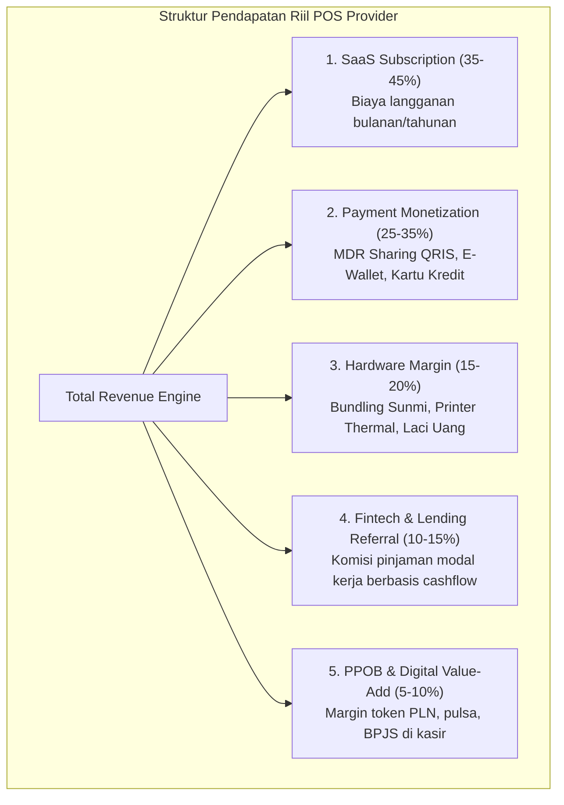
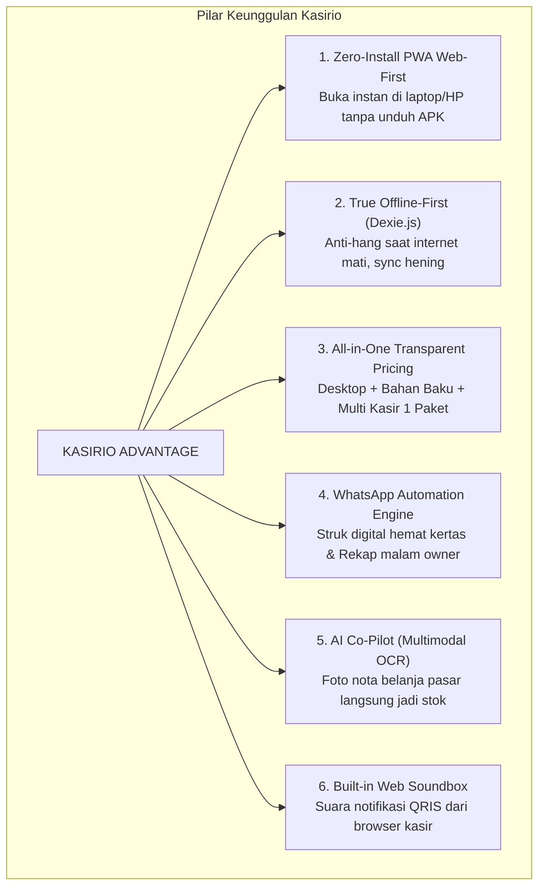

# 📊 LAPORAN RISET PASAR MENDALAM: LANSKAP INDUSTRI POINT OF SALE (POS) INDONESIA & BLUEPRINT STRATEGIS KASIRIO

**Disusun untuk:** Tim Produk & Strategi Bisnis Kasirio  
**Fokus Wilayah:** Indonesia (Pasar UMKM & Mid-Market Ritel/F&B)  
**Tahun Analisis:** 2026  

---

## EXECUTIVE SUMMARY

Industri Point of Sale (POS) di Indonesia telah bertransformasi dari sekadar "alat pencatat mesin kasir digital" (*cash register replacement*) menjadi **pusat sistem saraf operasional dan finansial (*operating system of business*) bagi UMKM**. Dengan populasi lebih dari 64 juta pelaku UMKM di Indonesia dan penetrasi pembayaran nontunai nasional (terutama QRIS Bank Indonesia) yang mencapai rekor tertinggi, pasar perangkat lunak kasir berada pada fase transisi krusial:

1. **Kejenuhan Model Warisan (*Legacy Fatigue*):** Pedagang mulai frustrasi dengan pemain generasi pertama yang menaikkan harga langganan, memberlakukan biaya *add-on/plugin* tersembunyi (*nickel-and-diming*), serta menyediakan *customer support* yang lambat dan didominasi bot otomatis.
2. **Ketergantungan Internet yang Menjebak:** Sebagian besar cloud POS berbasis web murni sering *hang* atau lambat pada jam-jam sibuk (*peak hours*), menyebabkan antrean panjang dan komplain pelanggan.
3. **Peluang Besar bagi Kasirio:** Pendekatan **Progressive Web App (PWA) Offline-First**, harga transparan *All-in-One*, otomasi WhatsApp (struk digital & rekap malam ke owner), serta **AI Co-Pilot** (OCR nota belanja pasar & deteksi kecurangan kasir) merupakan proposisi nilai yang secara presisi menjawab seluruh titik nyeri (*pain points*) pedagang Indonesia saat ini.

---

## PILAR 1: LANSKAP KOMPETITOR UTAMA & PENAWARAN MEREKA

Pasar POS di Indonesia terfragmentasi menjadi 3 klaster utama:
* **Klaster Korporasi/Ekosistem Konglomerat:** Moka POS (GoTo).
* **Klaster All-in-One Super-App:** Majoo, Olsera, Pawoon.
* **Klaster Spesialis Vertikal & Akar Rumput (Grassroot):** ESB (Vertikal F&B), Qasir, Kasir Pintar.

### 1.1 Analisis Detail Tiap Pemain Kunci

| Nama Pemain | Pemilik / Induk | Model Harga & Skema Langganan | Fitur Unggulan Utama | Ekosistem Pendukung | Kelemahan Arsitektural / Titik Rawan |
| :--- | :--- | :--- | :--- | :--- | :--- |
| **Moka POS** | GoTo Group (GoTo Financial) | **Premium (Per Outlet):** • Basic: Rp 299.000/bln • Pro: Rp 499.000/bln • Enterprise: Rp 799.000+/bln *(Belum termasuk PPN 11%)* | Integrasi GoBiz/GoFood, manajemen meja F&B, Moka Order (QR meja), laporan konsolidasi multi-cabang, loyalitas pelanggan. | Terhubung erat ke GoPay, GoModal (pinjaman), GoFood, dan ekosistem merchant GoTo. | Biaya per outlet sangat mahal bagi UMKM beranak cabang; CS sering dikeluhkan lambat merespons; laporan akuntansi kurang dalam. |
| **Majoo** | PT Majoo Teknologi Indonesia | **Tiered All-in-One:** • Starter: Rp 249.000/bln • Advance: Rp 499.000/bln • Prime: Rp 999.000/bln • Majoolite (Mikro): Rp 50.000/bln | POS, absensi & payroll karyawan (kamera selfie), mini toko online (e-commerce), laporan akuntansi, order online terintegrasi. | Majoo Capital (fintech), Majoo Pay, Toko Web, kemitraan GrabFood/ShopeeFood. | Fitur terlalu padat (*bloated*) sehingga membingungkan pemula; komitmen kontrak tahunan kaku; setup awal butuh waktu lama. |
| **ESB POS** | PT Esensi Solusi Buana (ESB) | **Freemium to Enterprise:** • Basic: Rp 0/bln (fitur terbatas) • Advanced: Rp 499.000/bln • Enterprise: Kustom (jutaan/bulan per brand) | Spesialis mutlak F&B: Kitchen Display System (KDS), split/merge bill meja rumit, Bill of Materials (BOM) resep gramasi presisi, ESB Order. | ESB Core (ERP F&B), ESB Kiosk, ESB Loop (CRM), OLIN (AI forecasting), ESB Goods (B2B supply bahan baku). | Tidak cocok untuk ritel non-makanan; antarmuka desktop terasa padat teknis; onboarding membutuhkan implementor profesional. |
| **Olsera POS** | PT Olsera Pratama Mandiri | **Tahunan Hemat:** • Basic: Rp 1.288.000/thn (~Rp 107k/bln) • Premium: Rp 1.988.000/thn (~Rp 165k/bln) • Pro: Rp 2.688.000/thn (~Rp 224k/bln) | Sangat kuat di ritel, grosir, apotek, dan toko modern; mendukung sinkronisasi e-commerce toko online mandiri; multiplatform (Android, iOS, Windows). | Integrasi software akuntansi (Jurnal, Accurate), web store builder, point rewards. | Antarmuka visual (UI) cenderung konservatif; kurva pembelajaran fitur inventori cukup curam bagi pedagang awam. |
| **Pawoon** | PT Pawoon Pos Indonesia | **Bulanan Menengah:** • Free: Max 500 transaksi/bln • Basic: Rp 299.000/outlet/bln • Pro: Sesuai kebutuhan cabang | Desain antarmuka bersih, cepat dipelajari kasir baru, manajemen meja kafe, integrasi pembayaran digital. | Pawoon Pay, integrasi EDC bank, laporan dashboard berbasis cloud. | Inovasi fitur melambat dalam 2-3 tahun terakhir dibanding kompetitor; fitur add-on terbatas; opsi offline sync kadang bermasalah. |
| **Qasir** | PT Solusi Teknologi Niaga | **Mikro-Grassroot:** • Free Plan (Gratis selamanya) • Pro: Rp 399.000 - Rp 699.000/tahun • Beli Fitur Satuan (Ala Carte: Rp 20k - Rp 50k per fitur) | Model ala carte (bayar hanya fitur yang dipakai, misal laporan stok atau absensi kasir), sangat ringan di smartphone spesifikasi rendah. | Miqro (toko online WhatsApp), PPOB, Qasir Pay (QRIS). | Fitur dasar sangat minim; jika membeli banyak fitur satuan, total biaya mendekati software pro; kapabilitas multi-cabang terbatas. |
| **Kasir Pintar** | PT Kasir Pintar Internasional | **Freemium & Add-on Heavy:** • Free: Max 1.000 barang, 1 user • Pro: Rp 55.500/outlet/bulan • Add-on Plugin: Desktop (Rp 55.5k), Bahan Baku (Rp 55.5k), Food Menu, StaffPlus | Populer di akar rumput Jawa Timur/Indonesia Timur, database produk offline-to-cloud, komunitas pengguna besar, PPOB bawaan. | Olshopin (katalog WA), Komunitas Sobat Kasir Pintar, PPOB, integrasi printer Bluetooth universal. | **Penetapan harga semu (*nickel-and-diming*):** Biaya dasar murah, namun jika butuh POS di laptop Windows dan resep makanan, biaya melonjak 3x lipat; UI terasa jadul. |

---

## PILAR 2: FAKTOR KETAHANAN BISNIS (WHY THEY SURVIVE & WIN)

Mengapa perusahaan POS mampu bertahan meskipun persaingan harga langganan (*SaaS subscription*) sangat berdarah-darah? Jawabannya terletak pada **diversifikasi aliran pendapatan non-langganan** dan **tingginya biaya peralihan (*switching costs*)**.

### 2.1 Sumber Pendapatan Riil di Luar Biaya Langganan

1. **Monetisasi Transaksi (MDR Sharing QRIS & Payment Gateway):**
   - Transaksi QRIS di Indonesia terus meroket. Sesuai aturan Bank Indonesia, MDR untuk Usaha Mikro (UMI) transaksi di atas Rp 100.000 adalah **0,3%**, sedangkan untuk Usaha Kecil/Menengah/Besar berkisar **0,7%**.
   - Penyedia POS bekerja sama dengan acquirer / Payment Gateway (Xendit, Midtrans, Duitku, Netzme, Nobu, BCA) dan mendapatkan bagi hasil (*margin cut*) berkisar **0,1% – 0,2%** dari volume transaksi kotor (GTV). Pada merchant F&B dengan omzet Rp 100 juta/bulan, POS provider bisa meraup Rp 100.000 – Rp 200.000 pasif di luar biaya langganan.
2. **Bundling & Markup Hardware Kasir:**
   - Margin kotor hardware kasir berkisar **20% – 35%**.
   - Menjual paket perangkat: Printer thermal Bluetooth 58mm/80mm (harga grosir Rp 150.000 dijual Rp 275.000), Barcode Scanner nirkabel, laci kasir otomatis (*cash drawer* RJ11), serta terminal Android terdedikasi (seperti Sunmi V2s / iMin D1).
3. **Fintech Lending Referral (Merchant Cash Advance):**
   - POS provider memegang data emas: **histori transaksi harian dan kesehatan cashflow merchant**.
   - Mereka bermitra dengan P2P lending terdaftar OJK (KoinWorks, Modalku, Amartha, GoModal). Ketika merchant butuh modal ekspansi Rp 50 juta, POS platform menjadi agen perujuk (*referral partner*) dengan *success fee* **1% – 3%** dari total pinjaman yang disetujui tanpa risiko kredit (*zero credit risk* pada sisi POS).
4. **PPOB & Digital Goods:**
   - Merchant warung dan toko kelontong menggunakan aplikasi kasir untuk melayani pembelian token PLN, pulsa, bayar PDAM, dan voucher game bagi warga sekitar. POS platform mengambil margin Rp 500 – Rp 2.500 per transaksi tagihan.
5. **Jasa On-boarding & Kustomisasi Enterprise:**
   - Biaya jasa implementasi di lokasi (*on-site setup* & training karyawan) berkisar Rp 250.000 – Rp 1.500.000 per outlet (diterapkan oleh Majoo dan ESB).

### 2.2 Anatomi Switching Cost: Mengapa Merchant Sangat Sulit Pindah?

1. **Inersia Data Master Produk & Stok (Data Lock-in):**
   - Toko retail memiliki 2.000 – 10.000 SKU dengan barcode, harga beli (HPP), harga grosir bertingkat, dan stok opname. Kafe memiliki resep (BOM) dengan komposisi gramasi. Migrasi data ke sistem baru dianggap mimpi buruk operasional yang memakan waktu berminggu-minggu.
2. **Memori Otot Kasir & Staf Operasional (*Cashier Muscle Memory*):**
   - Saat jam sibuk, kecepatan tangan kasir menentukan panjangnya antrean. Mengganti sistem berarti melatih ulang kasir dan *waiter*. Pemilik bisnis sangat takut risiko transaksi lambat, kasir panik, dan kasir salah input harga saat hari-hari pertama transisi.
3. **Keterikatan Hardware (Hardware Lock-in):**
   - Merchant telah membeli printer thermal USB/Bluetooth, kabel laci uang, dan tablet yang sudah dikonfigurasi secara spesifik. Jika software baru tidak mendukung driver printer lama mereka, merchant menolak beralih karena enggan keluar modal hardware lagi.
4. **Keterikatan Multi-Cabang (*Franchise Chain Dependency*):**
   - Pemilik 5 cabang kafe memantau laporan konsolidasi setiap malam di satu akun. Mengganti sistem di salah satu cabang akan merusak konsistensi laporan laba rugi global.

---

## PILAR 3: SUARA PEDAGANG & TITIK NYERI TERBESAR (VOICE OF MERCHANT)

Berdasarkan analisis sentimen pedagang di forum UMKM, ulasan Google Play Store, dan wawancara lapangan:

### 3.1 Apa yang Paling Diinginkan Pemilik UMKM?

* **Ketenangan Pikiran (*Peace of Mind*):** Pemilik tidak perlu berada di toko 24 jam. Mereka ingin cukup mengecek HP dari rumah dan tahu persis: Berapa omzet hari ini? Berapa laba bersihnya? Berapa uang tunai yang harus disetor kasir ke laci? Barang apa yang mau habis?
* **Transaksi Super Cepat (Maksimal 3 Ketukan Layar):** Kasir tidak boleh disibukkan dengan menu yang berputar-putar. Masukkan barang → tekan nominal uang pas → struk keluar dalam hitungan < 3 detik.
* **Penyimpanan Kasbon (Piutang Warung) yang Tertib:** Di tingkat akar rumput, kasbon pelanggan tetangga adalah realitas sehari-hari. Pemilik butuh pencatatan kasbon yang rapi dan cara menagih yang sopan tanpa merusak silaturahmi.

### 3.2 Keluhan & Frustrasi Terbesar terhadap Software Saat Ini

1. **Kenaikan Harga Diam-Diam & Jebakan Add-on (*Nickel-and-Diming*):**
   - Kasir Pintar memikat pengguna dengan harga Rp 55.500/bulan. Namun ketika pemilik ingin mengoperasikan kasir di laptop Windows kasir utama, mereka diwajibkan berlangganan "Plugin Desktop". Ketika kafe ingin menginput resep kopi, mereka ditagih "Plugin Bahan Baku" lagi. Total tagihan membengkak hingga Rp 160.000 – Rp 200.000+/bulan. Merchant merasa dijebak (*deceived*).
2. **Crash & Hang Saat Jam Sibuk (Kerapuhan Cloud Murni):**
   - Mayoritas cloud POS memerlukan ping internet konstan. Ketika koneksi internet kafe drop di jam makan siang, aplikasi berputar (*spinner*), gagal memproses cetak struk, atau terjadi transaksi ganda (*duplicate charge*). Ini memicu kepanikan kasir di depan antrean pembeli yang mengular.
3. **Customer Support yang Lambat & Dinding Robot WhatsApp:**
   - Saat jam makan siang hari Minggu sistem kasir error, merchant panik dan menghubungi WhatsApp support. Namun mereka hanya disambut oleh bot otomatis dengan opsi menu 1-9 atau dijanjikan *tiket investigasi* yang baru dibalas 4 jam kemudian saat toko sudah tutup. Merchant butuh respon manusia yang sigap.
4. **Kebocoran Kasir & Penipuan Internal (*Internal Fraud & Leakage*):**
   - **Manipulasi Void/Batal Nota:** Kasir menerima uang tunai dari pelanggan, tidak langsung mencetak struk atau membatalkan (*void*) transaksi setelah pelanggan pergi, lalu mengantongi uang tunai tersebut.
   - **Buka Laci Kasir Tanpa Transaksi (*No-Sale Drawer Opening*):** Kasir membuka laci uang secara manual untuk mengambil uang kembalian atau mencuri uang tunai.
   - **Diskon Manual Sepihak:** Kasir memberikan diskon kepada teman atau keluarga tanpa izin pemilik toko.
5. **Penipuan Bukti Bayar Palsu dari Pembeli (External Fraud):**
   - Pembeli nakal menunjukkan tangkapan layar (*screenshot*) m-Banking palsu yang sudah diedit atau menunjukkan transfer lama. Kasir yang terburu-buru meloloskan barang tanpa mengecek mutasi rekening bank secara langsung.

### 3.3 Isu Kepatuhan Lokal & Regulasi Pajak

1. **Distingsi Pajak Daerah (PB1 / PBJT 10%) vs PPN Pusat (11% / 12%):**
   - Masih banyak pemilik kafe/resto pemula yang bingung antara Pajak Restoran (PBJT Makanan dan Minuman, kewenangan Pemda) dengan Pajak Pertambahan Nilai (PPN, kewenangan DJP pusat).
   - Berdasarkan aturan UU HKPD, makanan dan minuman yang disajikan di restoran/kafe **bukan objek PPN**, melainkan PBJT (maksimal 10%). Namun banyak software kasir yang melabeli pajak restoran dengan nama "PPN", memicu keluhan pembeli dan audit Dispenda lokal.
2. **Kesiapan Coretax DJP (Core Tax Administration System):**
   - Bagi pedagang ritel yang berstatus Pengusaha Kena Pajak (PKP), implementasi Coretax DJP menuntut integrasi data faktur pajak retail (kode faktur, NIK/NPWP 16 digit pembeli). Software kasir yang belum siap menerbitkan format rekap siap upload SPT Masa PPN membuat akuntan toko pusing.
3. **Regulasi QRIS Bank Indonesia & Keamanan Fisik:**
   - **Sindikat Penempelan Stiker QRIS Palsu:** Maraknya kasus stiker akrilik toko ditimpa stiker QRIS penipu membuat pedagang resah. Pedagang mulai beralih ke **QRIS Dinamis** (QR muncul di layar POS sesuai nominal pasti) dan mendambakan **QRIS Soundbox** (notifikasi suara transaksi berhasil).

---

## PILAR 4: PELUANG STRATEGIS & GAP YANG BISA DIMANFAATKAN KASIRIO

Kasirio tidak boleh bertarung dengan cara meniru persis apa yang dilakukan Moka atau Majoo. Kasirio harus memposisikan diri sebagai **"Next-Gen Lean POS"** yang memotong segala kerumitan teknis dan biaya semu.

### 4.1 Mengapa Pendekatan PWA Web-First adalah Pembeda Radikal?

1. **Zero-Installation & Bebas Keterikatan Perangkat:**
   - Pemilik toko tidak perlu mendownload file APK 150 MB dari Play Store atau menginstal installer Windows yang berat. Cukup buka link URL di browser Chrome/Edge, login, dan dalam 5 detik mesin kasir sudah siap pakai.
   - Dapat diinstal instan ke Desktop (Windows/macOS) maupun *Home Screen* Android/iOS sebagai aplikasi mandiri (*standalone window*) tanpa memakan memori perangkat.
2. **Bebas Komisi Toko Aplikasi (No 30% App Store Cut):**
   - Kasirio terhindar dari potongan transaksi Google Play Billing atau Apple App Store, memungkinkan penawaran harga langganan yang jauh lebih terjangkau dan sehat bagi arus kas perusahaan.
3. **Pembaruan Instan Tanpa Repot (Instant Hotfix Deployment):**
   - Setiap pembaruan fitur atau perbaikan bug langsung terdistribusi ke seluruh cabang merchant di seluruh Indonesia saat halaman di-refresh. Tidak ada drama *"kasir lupa update aplikasi di Play Store sehingga stok bentrok"*.

### 4.2 Arsitektur True Offline-First (Dexie.js / IndexedDB)

- **Transaksi Nol Latensi:** Setiap penekanan tombol bayar dan pencetakan struk diselesaikan di database lokal browser dalam waktu **< 15 milidetik**, tanpa menunggu respon jaringan internet.
- **Deteksi Jaringan & Auto-Sync di Latar Belakang:** Ketika internet mati, lampu indikator berubah kuning/merah, namun transaksi kasir tetap berjalan 100% normal. Saat koneksi pulih, antrean transaksi (`syncQueue`) terkirim otomatis ke PostgreSQL server tanpa mengganggu aktivitas kasir yang sedang melayani antrean.

### 4.3 Menghancurkan Model Bisnis "Plugin" Lawan (Transparent All-in-One)

- **Strategi Pukulan Balik terhadap Kasir Pintar:**
  - Kasirio menghadirkan **Satu Paket Berlangganan Lengkap**: Sudah mencakup akses Desktop PC, akses Smartphone Android, modul Resep/Bahan Baku (BOM), dan hak akses staf kasir tanpa biaya add-on tambahan.
  - Tagline kampanye: *"Berhenti Membayar Biaya Siluman. Satu Akun Kasirio, Lengkap untuk Semua Perangkat dan Kebutuhan Usaha Anda."*

### 4.4 WhatsApp Omnichannel Automation (Fitur Paling Dicintai Pedagang)

1. **Struk Digital WhatsApp (Hemat Kertas Struk):**
   - Biaya kertas thermal 58mm/80mm memakan biaya Rp 50.000 – Rp 150.000/bulan per outlet.
   - Kasirio menyediakan tombol 1-klik `Kirim Struk WA`: Pelanggan menerima tautan struk interaktif atau ringkasan teks belanja rapi ke nomor WhatsApp mereka.
2. **Daily Nightly WhatsApp Brief ke Owner (Pukul 22.00):**
   - Bot WhatsApp Kasirio mengirim pesan otomatis ke nomor pribadi owner:
     > *"Halo Bos Budi! Toko Kopi Utama hari ini membukukan omzet Rp 2.850.000 (Estimasi Laba Bersih: Rp 950.000). Kas tunai di laci: Rp 1.400.000, QRIS: Rp 1.450.000. Menu terlaris: Kopi Gula Aren (42 cup). Catatan: Stok Susu UHT tersisa untuk 1 hari lagi."*
   - Fitur ini memberikan **efek magis (*peace of mind*)** tanpa pemilik harus membuka laptop atau login ke dashboard admin.
3. **Pengingat Kasbon Sopan:**
   - Modul pencatatan utang pelanggan dengan fitur kirim invoice pengingat kasbon ramah via WhatsApp: *"Halo Kak Ani, sekadar mengingatkan catatan belanja di Toko Berkah sebesar Rp 45.000. Terima kasih!"*

### 4.5 AI Co-Pilot: Senjata Generasi Baru yang Tidak Dimiliki Lawan

1. **Smart OCR Nota Belanja Grosir / Pasar Tradisional:**
   - **Masalah Nyata:** Pemilik warung atau kafe belanja bahan baku di pasar tradisional, toko grosir, atau supermarket bahan mentah. Mereka menerima nota kertas bertuliskan tangan atau struk panjang. Menginput 25 item belanjaan satu per satu ke sistem POS membutuhkan waktu 1 jam.
   - **Solusi Kasirio AI:** Cukup foto nota kertas tersebut dengan kamera ponsel. Memanfaatkan Vision AI (Gemini Flash API), sistem otomatis membaca nama barang, jumlah kuantitas, harga beli satuan, dan langsung menambahkan stok serta mengkalkulasi HPP (*Cost of Goods Sold*) otomatis.
2. **AI Kasir Leak & Anomaly Detection:**
   - Mendeteksi anomali perilaku kasir: Kasir yang terlalu sering menekan tombol void/batal setelah pembeli pergi, kasir yang sering memberikan diskon manual tanpa transaksi normal, atau selisih fisik kas laci vs sistem yang konsisten di shift kasir tertentu. Sistem mengirim peringatan privat ke WhatsApp pemilik.
3. **Virtual Web Soundbox (Inovasi Pencegah Struk Palsu Tanpa Beli Hardware):**
   - Merchant tidak perlu membeli perangkat keras QRIS Soundbox fisik seharga Rp 300.000 + biaya langganan kartu SIM Rp 25.000/bulan.
   - Melalui Web Speech API / Audio API di PWA Kasirio, begitu webhook QRIS dinamis berhasil terverifikasi, browser kasir/HP langsung mengeluarkan suara lantang dalam bahasa Indonesia: *"Pembayaran QRIS Rp 45.000 berhasil diterima!"* Kasir mendengar konfirmasi tanpa perlu menengok layar HP pembeli.

---

## REKOMENDASI STRATEGI PRODUK, HARGA, & GO-TO-MARKET (GTM)

### 1. Struktur Paket Harga Kasirio (Strategi Disrupsi)

| Komponen | Kasirio Starter (Free Tier) | Kasirio Pro (Sweet Spot) | Kasirio Multi-Cabang |
| :--- | :--- | :--- | :--- |
| **Target Pengguna** | Warung mikro, gerobakan, usaha rintisan | Kafe, Resto, Toko Retail, Apotek, Barbershop | Franchise & Bisnis Ritel 3+ Outlet |
| **Harga** | **Gratis Selamanya** | **Rp 49.000 / outlet / bulan** *(atau Rp 499.000/tahun)* | **Rp 129.000 / bulan (hingga 3 cabang)** |
| **Katalog Produk** | Hingga 300 SKU | **Unlimited SKU** | **Unlimited SKU** |
| **Dukungan Perangkat** | Smartphone / Web Browser (1 Akun) | **PWA Multi-Device (Laptop PC + Tablet + HP)** | Multi-Device + Dashboard Konsolidasi |
| **Modul Resep (BOM)** | Tidak termasuk | **Full Termasuk (Tanpa Biaya Plugin)** | **Full Termasuk + Transfer Bahan Baku** |
| **Struk Transaksi** | Struk Text WhatsApp | Custom Logo, Struk Thermal Bluetooth/USB & WA | Custom Logo, Struk Thermal & WA |
| **Otomasi WhatsApp** | Kirim manual via link | **Daily Nightly Bot Recap + Reminder Kasbon** | Daily Recap per Cabang ke Grup Owner |
| **AI Co-Pilot** | 5x Scan Nota OCR / bulan | **50x Scan Nota OCR / bulan + Leak Alert** | Unlimited Scan Nota + Analisis Cabang |

### 2. Taktik Penetrasi Pasar (Go-To-Market Playbook)

1. **Kampanye Edukasi Disrupsi: "Anti Biaya Plugin Siluman"**
   - Buat konten komparasi transparan di media sosial (TikTok, Instagram Reels, YouTube Shorts) yang membandingkan total pengeluaran 1 tahun menggunakan Kasir Pintar/Moka (termasuk biaya add-on desktop + bahan baku) vs Kasirio. Tunjukkan penghematan nyata Rp 1.500.000 – Rp 3.000.000 per tahun untuk pemilik kafe.
2. **Menyasar Komunitas Kafe & Kuliner Generasi Kedua:**
   - Masuk ke komunitas barista, roastery kopi, asosiasi pengusaha kuliner lokal, dan UMKM binaan perbankan. Anak muda penerus usaha orang tua sangat melek digital dan menginginkan tampilan modern, cepat, serta anti-ribet.
3. **Program "Tukar Nota Jadi Digital" (Showcase AI):**
   - Buat video viral demonstrasi kasir memotret nota lecek pasar tradisional dengan kamera smartphone, lalu seketika dalam 2 detik seluruh 20 barang belanjaan langsung masuk ke stok toko tanpa mengetik sehuruf pun. Ini adalah *wow factor* terkuat Kasirio untuk akuisisi viral.
4. **Kemitraan Perangkat Hardware Fleksibel:**
   - Tidak memaksa pedagang membeli hardware khusus. Berikan rekomendasi printer thermal sejuta umat (VSC, Iware, Panda) yang berharga Rp 150.000 di Tokopedia/Shopee dan buktikan bahwa PWA Kasirio langsung mengenali printer tersebut via WebUSB/Bluetooth dalam 1 kali klik.
